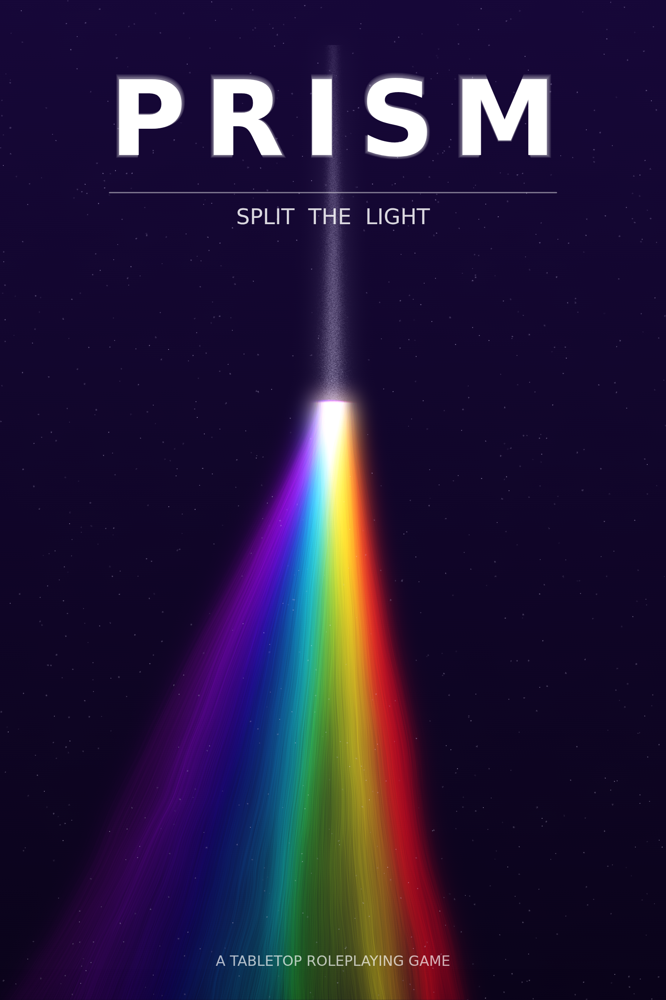

# PRISM

*Split the light*

A tabletop roleplaying game.

---

## Contents

1. [Welcome to the Show](#welcome-to-the-show)
2. [How to Play](#how-to-play)
3. [Making a Star](#making-a-star)
4. [Transformation](#transformation)
5. [Trouble](#trouble)
6. [Five Stars, Ready to Play](#five-stars-ready-to-play)
7. [Your Town and the Spectrum](#your-town-and-the-spectrum)
8. [Running the Game](#running-the-game)
9. [The Gloom](#the-gloom)
10. [The First Number](#the-first-number)

---

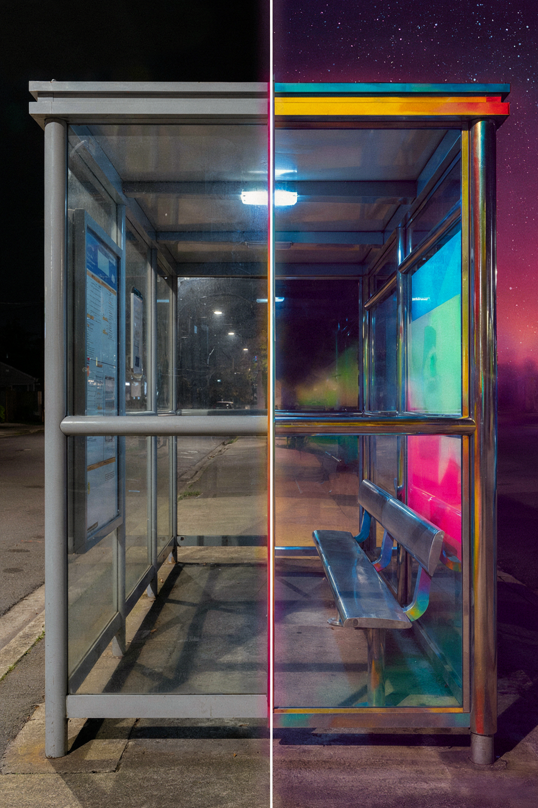
# Welcome to the Show

## What you do in this game

Somewhere near you, something good is being allowed to go grey.

The night bus that used to run past the chip shop. The library that opens
three days a week now, then two. The friend who stopped answering, and it has
been a month, and everyone assumed somebody else had checked.

In PRISM, you and three or four friends play the people who notice. You cross
into a layer of the world where that greyness has a body, a real body, with a
face and a reach and a name, and you **morph**, and you hit it until it lets
go. You do this on foot, or on a skateboard made of light, or on a robot
unicorn with chrome hooves and a mane like a gradient. All of these are equally
correct.

Then you come home and the bus is running again.

That is the whole game. You are not chosen. You have no bloodline, no secret
academy, no prophecy with your initials on it. You have your friends, a
handful of dice, and the specific stubborn refusal to let a thing you love get
quietly dimmer.

PRISM is bright. It is loud. Nobody dies in it, ever, not the villains, not
you. When you lose a fight you go dim, and you sit there greyed out and
present, and the game's single most important rule is that somebody can always
reach you.

And it has one rule that is the whole game in a sentence: **the five of you
cannot combine into the big thing until nobody has been left out.** The
spectacular move at the end of the night is locked until every person at the
table has had their moment. That is not a theme PRISM talks about. It is a
trigger condition.

It is also sincere. This book is not going to nudge you in the ribs about how
silly rainbows are. Rainbows are not silly. Bring your whole heart; you will
need it, and so will everyone else at the table.

## The everyday and the Spectrum

There are two layers, and both of them are real.

**The everyday** is the world you actually live in. Not a drab version of it, just the ordinary one, with its bin collections and its group chats and its
weather. Nothing is hidden here. There is no masquerade to protect and nobody
to keep secrets from. The everyday is simply the world with all its colour
still folded up inside it, the way white light carries every colour at once
without showing you any.

**The Spectrum** is what you get when that light splits.

It is the same places, your street, your school, the launderette on the
corner, rendered in howling airbrushed rainbow. Gradient skies. Chrome that
reflects colours which are not there. Leopard print on things that have no
business wearing leopard print. Dolphins, sometimes, moving through the air
above the ring road as though it were a reef. Glitter behaves like weather over
there, and settles like snow, and nobody finds this strange.

And the neglect has a body.

What is a funding shortfall in the everyday is, in the Spectrum, a thing with
a shape. Something enormous and patient and not really cruel, because cruelty
would require it to want something. It does not want anything. It just keeps
taking, the way a low place keeps collecting water. That is the horror of it,
and also the reason you can beat it: it has no plan. You do.

Crossing over is called **refracting**, and here is the important part: you do
not refract and *then* morph. It is one act. You step sideways out of the
everyday and you arrive already transformed, already glowing, already saying
the thing you say.

What you do over there changes things back here. That is not a metaphor the
book is being coy about. You break the shape, and the route runs again.

## What you need to play

Not much.

- **Four to six people.** One is the Showrunner and runs the world; the rest
  play Stars, so three to five Stars. Four is the sweet spot, and the
  ready-made team in Chapter 6 is five.
- **Two six-sided dice.** One pair is genuinely enough, passed around. More is
  nicer.
- **Something to write on.** Character sheets are at the back of this book, and
  you are welcome to photocopy them into oblivion.
- **An evening.** A complete PRISM story, a **Number**, takes one sitting.
  Three to four hours, snacks included.
- **Pencils.** You will be rubbing things out. Bonds change.

That is it. There is no starter set to buy, no map to print, no app.

## What a night of PRISM looks like

Four beats, about four hours.

You start in the ordinary world and stay there a while: work, family, the group
chat, somebody's terrible week. Then something small goes wrong that shouldn't
have, and you go and look at it, and looking does not fix it.

Somewhere in the middle, one of you says a true thing out loud that you have
been avoiding all evening. That is when everybody morphs, and the table gets
loud, and nobody rolls dice for several minutes because somebody is describing
what they look like now.

Then the fight, which is a race: their clock going down against your Shine going
down. Somebody goes dim. Somebody goes and gets them.

And then you come home, and the bus is running, and that is the end.

## Safety and consent at the table

Read this part before you read the rules. It matters more than the rules.

PRISM asks you to be earnest in front of your friends. You will say a
transformation phrase out loud. You will describe what your character looks
like when they are being most themselves. You will, at some point, have your
character admit something true because the mechanics rewarded it. That is a
lot to ask of people, and it is exactly why a game this warm needs *more* care
about consent than a cynical one, not less. Sincerity has no armour on it.

So, before the first Number:

**Lines and veils.** Go round the table. A **line** is something that does not
appear in this game at all, name it, and it is gone, no reasons required and
no follow-up questions. A **veil** is something that can exist but happens off
screen: we cut away, we come back after. Write both lists down where everyone
can see them. Add to them any time, including mid-scene, including without
explaining why.

**A way to stop.** Agree on a signal, an X drawn on a card, a hand raised, the
word "pause". Anyone can use it, including the Showrunner, at any moment. When
it happens, the scene stops immediately and nobody asks what was wrong. You
rewind, adjust, and carry on. Using it is never rude and never a big deal, and
the first time someone uses it the table should thank them, briefly and
genuinely, and then move on.

**Check in at the Encore.** Between Numbers, ask two questions out loud: what
did you love, and is there anything you would rather we did not come back to?
Thirty seconds each. It will change how your next session goes.

**A note on the Gloom.** The things PRISM builds monsters out of are real: a
service being cut, a person being forgotten, someone quietly burning out. Some
of those will be close to somebody's actual life. Ask before you build a Gloom
from a subject, not after. "Is a hospital one okay tonight?" costs nothing.

**Nobody dies.** Worth repeating here, because it changes what is safe to
invest in. Your Star cannot be killed, cannot be permanently maimed, and cannot
be taken away from you. The worst thing that happens is that they go dim and
somebody has to come and get them.

## How to read this book

If you are going to **play a Star**: read this chapter, then [Chapter 2](#how-to-play) (how
rolling works), then [Chapter 3](#making-a-star) (how to make someone). That is about forty
minutes and then you are ready. [Chapter 6](#five-stars-ready-to-play) has five finished Stars if you would
rather just pick one and start tonight, no shame in it, that is what they are
for.

If you are going to **run the game** as Showrunner: read everything, but read
[Chapter 8](#running-the-game) twice. [Chapter 7](#your-town-and-the-spectrum) teaches you how to turn a real problem in your own
town into a monster, which is the job. [Chapter 9](#the-gloom) has six ready-made ones for
when you want to skip that step, and [Chapter 10](#the-first-number) is a complete first Number you
can run cold.

Chapters 7 to 10 are the Showrunner's. You are welcome to read them anyway and
it will spoil nothing, because PRISM has no secrets in it: no twist, no hidden
history, nothing the book is keeping from you.

If you have **never played a tabletop roleplaying game before**: welcome, this
is a good one to start with. The short version is that one person describes a
situation, everyone else says what their character does about it, and dice
settle the bits where it is genuinely uncertain. The character you play is
traditionally called a player character; in this book we call them a **Star**,
because that is what they are.

## A note on who gets to shine

Transformation in PRISM is self-expression. That is the whole of it.

Any Star can morph. Any Star can be the one in the flowing coat with the
comet-trail and the phrase that makes people cry, or the one with the working
clockwork and the brass, or the one who is mostly starfield. There is no look,
no colour, no register, and no kind of power that this game considers to belong
to one sort of person.

You will not find this mentioned again. It does not need arguing, and a book
that keeps announcing its own decency is exhausting to read. It is simply how
PRISM works, and every example in here is written that way.

Right. Get your dice.

## What this book is not

Three things, so you know before you buy in.

**It is not a campaign game.** PRISM is built for one evening at a time. You can
absolutely run it for a year, and [Chapter 5](#trouble) tells you what changes when you do,
but nothing here assumes you will.

**It is not a game about winning fights.** The dice decide how much a thing
costs, not whether you deserve it. There is no build to optimise, no character
who is mechanically better than another, and no way to lose permanently.

**It is not subtle.** If you want a game that treats sincerity as a risk to be
managed, this is the wrong one. PRISM asks you to say a transformation phrase
out loud in front of your friends, and it does not provide an ironic register to
hide in.

---

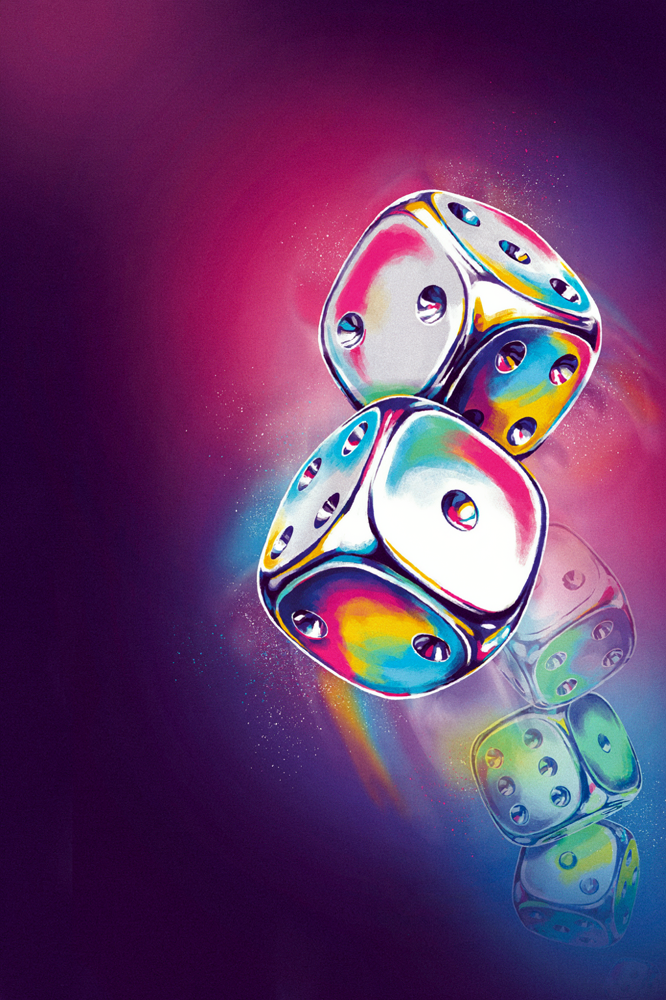
# How to Play

## The roll: 2d6 + Trait

When something is genuinely uncertain and it matters how it goes, you roll.

Take **two six-sided dice**. Roll them. Add them together. Add the **Trait**
that fits what you are doing. Compare the total to a **Difficulty** the
Showrunner names before you pick up the dice.

That is the entire resolution system. Everything else in this book is
decoration on that sentence.

You have four Traits, and each of them is rated **+0**, **+1**, or **+2**:

- **Heart**: sincerity, courage, connection. Standing your ground. Meaning it.
- **Flash**: speed, grace, performance. Physical daring, and doing it with style.
- **Craft**: cleverness, making, fixing, knowing. Taking a thing apart.
- **Cool**: composure, style, reading a room. Being the one who does not panic.

Every Star has one Trait at +2, two at +1, and one at +0. That never changes;
there is no advancement in PRISM and no way to buy your +0 up. The +0 is not a
flaw to be fixed. It is the most interesting thing on your sheet, and [Chapter 3](#making-a-star)
explains why at length.

**Which Trait?** The one that matches *how* you are doing it, not *what* you
are doing. Getting past a locked door with Craft means picking it. With Flash
it means going through the window. With Heart it means knocking, and meaning
it. With Cool it means walking in like you were expected. The Showrunner
should say yes to any of these if you can describe it convincingly.

Roll only when failure would be interesting. If your Star wants to get a cat
out of a tree and nothing is at stake, they get the cat out of the tree.

## Difficulties: 6, 9, 11

Three numbers. Learn them once and never look them up again.

| Difficulty | Name | Number | What it means |
|---|---|---|---|
| Easy | Anyone could | **6** | Awkward, not hard. You would manage on a bad day. |
| Tricky | Takes something from you | **9** | The honest middle. Most rolls live here. |
| Dazzling | Should not be possible | **11** | You are asking the world to make an exception. |

Dazzling is *hard*. With a +2 Trait, two dice cap out at 14, which is exactly
what a clean success at Dazzling requires: you need both dice to come up six
and your best Trait to be the right one. That is intentional. Most of the time
you do the impossible thing and it costs you something, and that is the correct
feeling.

The Showrunner picks the Difficulty before the roll, out loud, and does not
change it afterwards. If a player has an argument for a lower one, they should
make it before the dice hit the table.

## The outcome ladder

Compare your total to the Difficulty.

| Result | Outcome |
|---|---|
| **Under it** | **Miss.** It doesn't work, and the Showrunner makes a move. |
| **Meets it, or beats it by 1–2** | **Mixed.** It works, and it costs you. |
| **Beats it by 3 or more** | **Hit.** Clean. You get what you wanted. |
| **Both kept dice show 6**, on any success | **Flourish.** Clean, twice as effective, plus something extra. |

A **Miss** never means "nothing happens". The Showrunner always changes the
situation: that is the deal. The scene moves, just not the way you wanted.

A **Mixed** is a success. Say that part out loud at your table, because tables
who have played other games sometimes hear "mixed" and mentally file it under
failure. You did the thing. You just paid for it, and the next section says
exactly what with.

A **Flourish** is double sixes on the two dice you keep, on any roll that
succeeded. Not a margin, sixes. It is the same trigger at Easy and at
Dazzling, which is why it never becomes unreachable at the top of the ladder.

And here is the part that will matter more than you expect: **because you always
keep the best two dice, a Flourish gets more likely the more friends are
helping you.**

| Backers | Dice you roll | Chance of a Flourish |
|---|---|---|
| 0 | 2d6 | 2.78% |
| 1 | 3d6 | 7.41% |
| 2 | 4d6 | 13.19% |
| 3 | 5d6 | 19.62% |
| 4 | 6d6 | 26.32% |

On your own, a Flourish is a once-a-night lightning strike. With three friends
behind you it is a one-in-five shot, and at a five-Star table, with four, it is
better than one in four. Friendship in PRISM does not just make you more
reliable. It makes you *spectacular*.

## What a Mixed result costs

You succeeded. Now pay.

The Showrunner names **one** cost from this list. You may always refuse the one
they picked and lose **1 Shine** instead, that option is always open, so no
Mixed result can ever stall the table arguing about it.

| Cost | What it does |
|---|---|
| **Shine** | Lose 1. You are more worn down than you were. |
| **Sparkle** | Spend 1. Cannot be chosen if you have none left. |
| **Exposure** | Something true comes out, a secret, a position, a feeling. No number; the fiction changes. |
| **Time** | The Gloom gains 1 tick. You were busy, and it got a beat. |

Pick the one that hurts in the way the fiction wants. If a Star talks their way
past a security guard on a Mixed, Exposure is lovely, the guard now knows
their face. If they are running a rooftop, Shine. If they are arguing with
someone they love, Exposure again, and let it land.

**Exposure has no number on purpose.** It is the cost that changes the story
rather than the sheet, and it is usually the best one.

## Sparkle

**Sparkle** is your personal fuel. You start each Number with **3**, and **3**
is also your maximum: the Refrain refresh below tops you back up to it and
never past it.

Long play is the only thing that moves that ceiling, and it moves it slowly, to
a hard cap of **5**. For a one-shot, which is most PRISM, your maximum is 3 and
stays there.

Spend 1 Sparkle to:

- **Morph**: a Solo Morph, which [Chapter 4](#transformation) covers properly.
- **Reroll one die.** Any one die in the pool, once, after seeing it. If friends
  added dice, you may reroll any of them, including one you were not going to
  keep. Then keep the best two as normal.
- **Ignore 1 Shine loss.** You shrug it off. It looked like it hurt; it didn't.
- **Fuel a Finisher**: doubling the damage you do to a Gloom, once you are
  transformed.

You get Sparkle back by being who you said you were. Every Star has a
**Refrain**, a one-line creed. **When your Refrain costs you something in a
scene, take 1 Sparkle back**, once per scene, never above your maximum.

That is the loop the whole economy runs on. Your creed is not decoration; it is
your income. A Star whose Refrain is *"I don't leave people in the dark"* and
who keeps walking past people in the dark will run out of Sparkle, and should.

At an **Encore**, the downtime scene between Numbers, Sparkle refills
completely.

Sparkle is the thing you spend on yourself. It is deliberately *not* the
friendship mechanic. That one is next, and it works differently on purpose.

## Power of Friendship

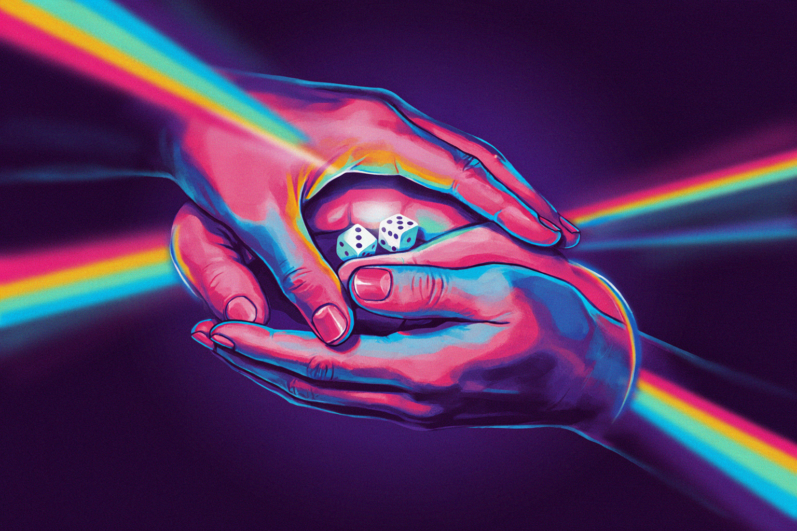

This is the centre of the game.

When another Star rolls, you may **back them**. Say how: what you shout, what
you do, what you put at risk. Then add **one extra d6** to their roll.

**They still keep only two dice.** Roll the whole handful, keep the best two,
add the Trait. Every die a friend adds is another chance at a good pair, but
the total never gets bigger than a two-dice total. Backing makes a good result
*likelier*, never larger. All the numbers in this book are calibrated for two
dice and stay that way no matter how many people pile in.

Here is what backing is worth, at Tricky with a +1 Trait:

| Backers | Chance of success |
|---|---|
| 0 | 41.7% |
| 1 | 68.1% |
| 2 | 82.6% |
| 3 | 90.6% |
| 4 | 94.9% |

One friend turns a coin flip into a comfortable favourite. That is not a
rounding error; that is the difference between the story going your way and
not.

### Backing costs the backer

Always. Pick one when you back:

- **Lose 1 Shine.** You put yourself in it.
- **Spend 1 Sparkle.** You burn something you were saving.
- **Give up your next action**: only during a Big Finish, where turns exist
  and that means something. In an ordinary scene, pick a different cost.
- **Expose something.** A secret, a weakness, a feeling you would rather not
  say out loud. This is usually the good one.

If you have an unspent **Bond** with the Star you are backing, you may **spend
the Bond** instead of paying anything else. It is the cheapest way to help
someone, and it is finite: a spent Bond stays spent until the next Encore,
where it comes back changed. You cannot lean on the same friendship all night.

### One roll, all the way through

Here is the whole system happening once, so you can see the shape of it.

> **Showrunner:** The bus is pulling away from the stop and it is enormous —
> three storeys of chrome and rust, and the doors are closing on the last
> person still on the pavement. What do you do?
>
> **Priya's player:** I want to jam the doors. Not with my hands: there's a
> hydraulic line running down the frame and I want to crimp it.
>
> **Showrunner:** Lovely. That's **Craft**, and it's **Tricky**. Difficulty 9.
> You're reaching into a moving machine the size of a house.
>
> **Priya's player:** Craft +2. Rolling two dice.
>
> *She rolls a 4 and a 3. Total 7, plus 2, is 9.*
>
> **Showrunner:** That meets it. Nine exactly, so it's a **Mixed**, the line
> crimps, the doors judder and stop. And it costs you. I'm going to say
> **Exposure**: your arm is inside the frame up to the shoulder and everyone on
> that pavement can see exactly who is doing this. You are not anonymous
> anymore.
>
> **Priya's player:** Ugh. Yes. Fine.

Now run the same moment with a friend in it.

> **Toby's player:** Can I back her? I skid in low and put my board under the
> door so it can't finish closing.
>
> **Showrunner:** You can. What does it cost you?
>
> **Toby's player:** Exposure as well — I'll shout her name. Loudly. Everyone
> hears it.
>
> **Showrunner:** Then Priya rolls **three** dice and keeps the best two.
>
> *She rolls 4, 3, and 6. She keeps the 6 and the 4. Total 10, plus 2, is 12.*
>
> **Showrunner:** Twelve against nine: you beat it by three. That's a **Hit**.
> Clean. The doors stop dead, no cost at all, and the Gloom clock goes down one.

Same dice. Same Star. One friend, one shouted name, and a Mixed became a Hit.

Notice what Toby did *not* do: he did not make the roll bigger. Priya still
added two dice and one Trait. He gave her another chance at a good pair, and
paid for it himself.

### The two rules that make it mean something

**You cannot back yourself.** Obviously.

**You cannot back someone you have never been honest with.** If your Stars have
never had a real conversation, if nothing true has ever passed between them,
the help is not available yet. Honesty does not expire: once a pair have had
that conversation, in this Number or any earlier one, they can back each other
from then on. Go and have the conversation. The
Showrunner should enforce this warmly, as an invitation rather than a penalty:
*"You'd love to help her, and you realise you don't actually know what's wrong.
Ask her."*

That rule is the whole game compressed into one sentence. In PRISM you do not
get stronger by acquiring things. You get stronger by being known.

**If you are using the ready-made Stars in [Chapter 6](#five-stars-ready-to-play)**, their Bonds are already
written, so they can back each other from the first scene, with one deliberate
exception: Marisol and Danny, whose Bonds are blank until somebody says the
thing. That is
deliberate: the rule exists for Stars a table builds itself, where the honesty
has to happen at the table before the help is available. One pair in [Chapter 6](#five-stars-ready-to-play)
has been left deliberately unfinished so you can see the rule bite.

## Shine and Gloom

Two tracks sit on the table, and the Big Finish is a race between them.

**Shine** is yours. Five boxes, though morphing lifts that: see [Chapter 4](#transformation). You lose Shine to Mixed costs, to backing your
friends, to a Gloom hitting back, and to pushing when you should not have.

At **0 Shine** you are **Dimmed**. You are not dead, nothing in PRISM kills
you. You are out of the scene, greyed out, still there, still visible, unable
to act. It is a horrible feeling and it is meant to be, because the way out of
it is the best rule in the book: **someone can always reach you.** No roll. It
always works. [Chapter 5](#trouble) has the details.

**Gloom** is the monster's. It is a clock of 4, 6, or 8 segments, and it
**starts full**: that is how deep the neglect goes. You win by emptying it.

| Your result | The clock |
|---|---|
| Miss | Gloom **+1**, if there is room. If it is already full, **you lose 1 Shine instead**, it has nowhere to spread, so it pushes back on you. |
| Mixed | Gloom **−1**, and you pay a cost |
| Hit | Gloom **−1** |
| Flourish | Gloom **−2** |

Empty the clock and you win: the monster breaks and the thing it was holding
comes back to the everyday. The Gloom only wins if **every** Star is Dimmed at
once, and even then nobody dies. You just cannot go on tonight, and that place
stays grey until somebody comes back for it.

A Miss can never make a problem worse than it already was. The Gloom does not
grow. It endures. That is what makes it Gloom and not a villain.

Put both tracks where the whole table can see them, the clock in the middle,
everyone's Shine in front of them. The tension in a Big Finish is entirely in
those two numbers moving toward each other, and it is much better felt than
described. Watching four Stars burn Shine to back each other while the clock
crawls down is the game working exactly as designed.

---

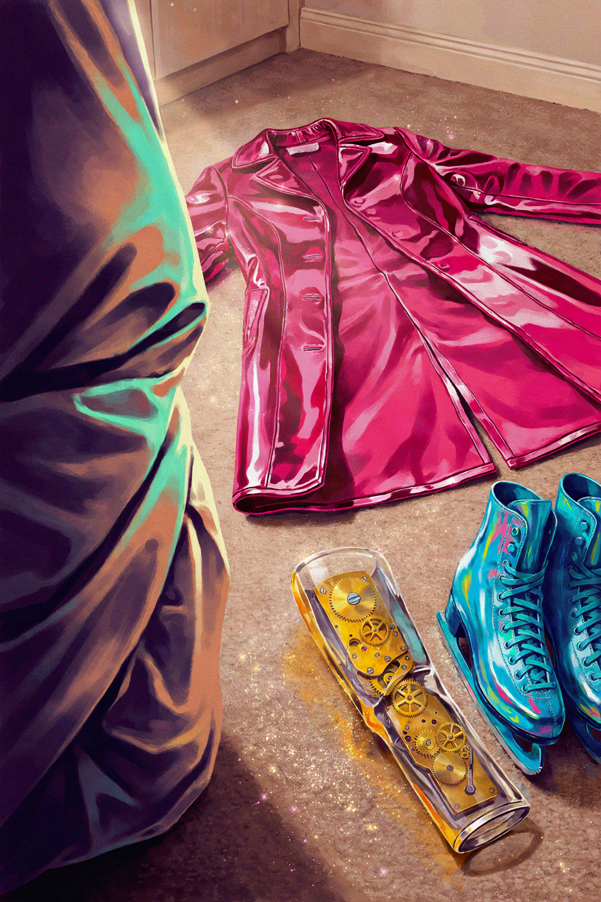
# Making a Star

## The twenty-minute procedure

You make Stars together, out loud, in one sitting. Not on your own at home the
week before, together. Half of what you are building is the web between you,
and you cannot build that alone.

Work through these in order. Do not skip ahead; each step feeds the next.

1. **Traits**, what you are good at. Five minutes for the table.
2. **Refrain**, your one line. Say it out loud when you have it.
3. **Signature**, the thing you are unmistakably about.
4. **Look**, who you are before any of this starts.
5. **Radiance**, who you are when you are most yourself. Take your time here.
6. **Bonds**, one line to each other Star. This is the long bit.
7. **The team**, a name, and the word you all shout.

Twenty minutes if you keep moving. Longer is fine. If you would rather play
tonight and build later, [Chapter 6](#five-stars-ready-to-play) has five finished Stars waiting.

## Traits: Heart, Flash, Craft, Cool

Four Traits. Assign them: one **+2**, two **+1**, one **+0**.

That spread is fixed. Everyone at the table has the same shape, one thing they
are great at, two they are fine at, one they are not. What differs between
Stars is *which*, and everything else on the sheet.

- **Heart**: sincerity, courage, connection, standing your ground, meaning it.
  Heart is not kindness. Heart is the willingness to be seen wanting something.
- **Flash**: speed, grace, performance, physical daring. Doing the difficult
  thing *and* making it look good, which in this game are the same skill.
- **Craft**: cleverness, making, fixing, knowing how a thing works. Craft is
  curiosity with its sleeves rolled up.
- **Cool**: composure, style, reading a room, being the one who does not
  panic. Cool is not detachment. Cool is holding steady so others can wobble.

Pick the +2 first, it is the thing your Star is known for. Then the +0.

### The +0 is the best number on your sheet

Do not treat it as damage. It is the reason you have friends.

Here is what a +0 actually means at the table: sooner or later the thing in
front of the group will be the thing your Star is worst at. Not "difficult for
them", genuinely outside them. And in that moment the game asks you a
question, which is the question PRISM is built to ask:

*What do you do when the problem in front of you is the one you cannot solve?*

The answer this game wants is **ask someone**. Not "try anyway and fail
forward". Not "have a different character step in". Turn to the person beside
you, out loud, in character, and ask. That is the whole design. The +0 is where
Power of Friendship stops being a nice option and becomes the only door.

So choose your +0 for drama, not for convenience. Give it to the thing your
Star most wishes they were good at. A Craft +0 who desperately wants to
understand how things work is worth ten optimised sheets.

## Your Refrain

One line. Your Star's own words. The thing they believe hard enough to lose
something over.

It is not a motto and not a catchphrase. It is a rule they hold themselves to,
phrased the way they would actually phrase it.

> *"I don't leave people in the dark."*
> *"Somebody has to be ridiculous first."*
> *"If it's broken I want to know why."*
> *"I can hold this. Someone has to."*
> *"You can tell me the bad version."*

Your Refrain is also your income. **When it costs you something in a scene,
take 1 Sparkle back**, once per scene. That is the only reliable Sparkle in
the game, so a Refrain that never costs anything will leave you broke.

Test it before you write it down: **can you imagine a scene where holding to
this line loses you something you wanted?** If not, it is a slogan. Sharpen it
until the answer is yes.

Say it out loud to the table. If it makes someone go *oh*, keep it.

## Your Signature

The one thing your Star is unmistakably about. It gets a name, and it does
something specific.

A Signature **drops a task one Difficulty band** when you are doing the thing
you are for: Dazzling becomes Tricky, Tricky becomes Easy. Or it makes
something *attemptable* that the Showrunner would otherwise not have offered a
roll for at all.

It is never a bonus to the roll. It never adds to your total. It changes what
you are up against, which is a bigger effect and a cleaner one.

**And below Easy there is nothing.** If your Signature would drop a task below
Difficulty 6, you simply do it. No roll. This is the commonest case at the
table and it is meant to feel like that: when a Star is doing the exact thing
they are for, against something ordinary, the dice have nothing to say.

> **The one who goes back.** Drops a band on any roll to reach, retrieve, or
> refuse to abandon someone.
>
> **Opening act.** Drops a band when doing something publicly, loudly, and first.
>
> **Takes it apart.** Drops a band on understanding how a thing, or a Gloom —
> actually works.

Write yours as a name plus a sentence beginning *"Drops a band when…"*. Keep
the condition narrow enough that it does not apply to everything. A Signature
that fires constantly is a broken one, and duller than a narrow one that fires
twice a night at exactly the right moment.

Your Signature also names one thing you can do **while transformed**, a
Radiance ability. Do not write it yet. Write it after Radiance, below, when you
know what you look like.

### How many of you

Everything in this book assumes four or five Stars. Fewer works; it just
changes shape, and you should know how before you start.

| Players | Bond lines | The Chord | What to watch |
|---|---|---|---|
| **3** | 6 | Fills fast | Combined Form arrives early. Consider a 6-clock minimum. |
| **4** | 12 | The intended pace | Nothing. This is the sweet spot. |
| **5** | 20 | Fills late | Bonds take forty minutes. Worth it, but budget for it. |

With **two** Stars, the Chord is two notes and the Combined Form stops being
rare. Play it anyway if that is who you have, but drop the Combined Form
entirely and let Synchronized Morph be the ceiling.

## Look

Who your Star is with the colour folded up. Before any of this starts.

Three or four specifics, no full paragraph. What they wear when nobody is
watching, how they carry themselves, one detail that is theirs.

> *Cargo coat two sizes too big, permanent headphones round the neck, laces
> never done.*

Keep it ordinary. The Look is the everyday, and the everyday is not drab, it
is just unsplit. The contrast with what comes next only works if this part is
somebody you would actually walk past.

## Radiance


This is the biggest thing you will write today. Take the time.

Your **Radiance** is what you are when the light splits. Not a costume, a
truer edition. Five things:

**Colour.** Pick one and commit to it entirely. Magenta. Cyan. Sunburst yellow.
Violet. Mint. It is your colour for the rest of the game; the table will start
referring to you by it within one session.

**Silhouette.** The shape you make against the sky. A coat that trails like a
comet. Working clockwork worn as armour. A stillness the Spectrum bends around.
Skates that leave a gradient behind them. One image, held hard.

**Sound.** What people hear. A chord. A skate wheel. Brass gears settling. The
first two beats of a song only you know.

**The phrase.** What you say as you refract. It is not optional and it is not
a joke. Write it now, and say it out loud at the table, and let the moment be
slightly embarrassing, that embarrassment is the toll you pay once, and after
that it is just yours.

> *"Nobody stays behind."*
> *"Watch this bit!"*
> *"Show me the seams."*
> *"Breathe. I've got the door."*
> *"Go on. I'm still here."*

**The object,** if you have one. A wand, a compact, a bus pass, a wrench, a
pair of scissors, a photograph. Not every Star needs one. The ones who do
should say what it was *before*, in the everyday, because that is the good part.

Now go back and write your Signature's transformed ability, in one sentence,
using the imagery you just made.

## Bonds: the web

Do this last, and do it out loud, and do not rush it. It is the best twenty
minutes of the session.

Every Star writes **one line to every other Star**. Not a rating, not a label, a specific shared truth, in your own words, about something that actually
happened between you.

Bad: *Priya is my best friend.*
Good: *Priya sat with me in the bus shelter for two hours and never once asked
what was wrong.*

Go round the table. When it is your turn, pick another Star and say your line
to that player, directly, out loud. They may add one sentence to it, a
detail, a correction, a *"that's not how I remember it"*, and then it is
written and it is true forever.

A Bond does two things:

- **It is spendable.** When you back that Star, you may spend the Bond instead
  of paying any other cost. It is the cheapest help in the game.
- **It is finite.** A spent Bond is marked and stays spent until the next
  **Encore**, where it comes back, rewritten, because something new is true now.

You cannot lean on the same friendship all night. That is the point.

And remember the rule from [Chapter 2](#how-to-play): **you cannot back someone you have never
been honest with.** Your Bonds are the record of that honesty. If two Stars
have no Bond, they cannot help each other yet, and the fix is a conversation
rather than a rules lookup.

## Naming the team, and the command word

Two last things, together, out loud.

**A name for the team.** Something they would actually call themselves. It can
be a bit rubbish. Most real ones are.

**The command word.** The thing you all shout to morph at once. Everyone
contributes; nobody vetoes. It should be slightly too much, a Synchronized
Morph is not a subtle event, and a command word that embarrasses you in the
shop is a command word that will land at the table.

> *"PRISM — SPLIT THE LIGHT!"*

Say it once now, together, so the first time is not in the middle of a scene.

You are done. Twenty minutes, and there are five people at this table who know
one true thing about each other.

## Watching one get made

Here is the procedure happening once, at speed, so you can see the joins.

> **Showrunner:** Traits first. One +2, two +1, one +0.
>
> **Player:** She's the one who fixes things. Craft +2. And she's… not brave?
> Not physically. Flash +0.
>
> **Showrunner:** So Heart and Cool at +1 each. What's her name?
>
> **Player:** Priya.
>
> **Showrunner:** Refrain. One line, her words, something she'd lose something
> over.
>
> **Player:** *"If it's broken I want to know why."*
>
> **Showrunner:** Can you imagine that costing her?
>
> **Player:** Oh, constantly. She'll stop to look at the thing while everyone
> else is running.
>
> **Showrunner:** Perfect. That's Sparkle in the bank every session. Signature?
>
> **Player:** *Takes it apart.* Drops a band when she's working out how
> something actually functions.
>
> **Showrunner:** Look?
>
> **Player:** Boiler suit with the sleeves cut off. Pockets full of things that
> aren't hers. Always slightly covered in something.
>
> **Showrunner:** And Radiance. Take your time.
>
> **Player:** Yellow. Sunburst yellow. And she's wearing… her coat is
> clockwork, actual working gears, and you can see them turning. Sound is brass
> settling. And she says — *"Show me the seams."*
>
> **Showrunner:** Say it properly.
>
> **Player:** *"Show me the seams."*
>
> **Showrunner:** Yeah. Now her transformed ability, one sentence, using that.
>
> **Player:** She can see how anything was put together, including people.
> Including Glooms.

Four minutes. Now she does Bonds with the other four, and she is finished.

Notice how much of that came out of the +0. Flash +0 made her someone who
stops rather than runs, which produced the Refrain, which produced the
Signature, which produced the image. The number you are worst at did most of
the character work.

## If you get stuck

**No Refrain is coming.** Ask what your Star would be embarrassed to be caught
caring about, then write that as an instruction to themselves.

**The Radiance feels generic.** You have probably reached for the genre instead
of the character. Go back to the Look, take one ordinary detail from it, and
make *that* the thing that goes impossible. The headphones become a corona. The
laces become light. Specific beats spectacular every time.

**Two Stars have nothing between them.** Good: that is a real answer, and it
is playable. Write the Bond as the absence: *"We have been in the same rooms
for two years and I could not tell you one true thing about him."* Then watch
what happens the first time one of them needs to back the other and finds they
cannot yet.

## Your first scene

You have a sheet. Here is how to use it without thinking hard.

**Lead with the Refrain.** In your first scene, put your Star in a position
where their line is relevant, and then hold to it in front of everyone. It
tells the table who you are faster than any description, and it usually earns
you a Sparkle inside ten minutes.

**Say the +0 out loud early.** The first time the group hits something in your
weak Trait, announce it: *"That's Flash. I'm nothing at Flash."* You are not
apologising: you are opening a door for somebody else to walk through, and
the game is built to reward them for doing it.

**Do not save your Sparkle.** New players hoard it. Three points is not a
war chest; it is roughly one morph and one reroll, and it refills every Encore.
Spend it on the first moment that feels big.

**Back somebody in the first hour.** It sounds your note, it costs you little
this early, and it establishes the habit before the Big Finish when it matters.

## The sheet, in one breath

Four Traits, one +2, two +1, one +0. A Refrain you can lose things over. A
Signature that drops a band when you are being most yourself. A Look that is
ordinary. A Radiance that is not. One Bond to every other Star, each of them a
true thing that happened.

Three Sparkle. Five Shine.

That is a complete character in a game where nothing on the sheet ever goes up,
and it is enough, because the part of your Star that grows is the part written
in other people's handwriting.

## A note for the Showrunner

You make a Star too, not one you play, but one you hold.

While the table builds, write down the one thing each player said that made
the room go quiet. The Refrain that landed, the Bond that made somebody sit
back, the phrase that got said twice because the first time was too quiet.
Those five notes are your session plan. Every one of them is a promise you can
keep in the first hour, and keeping them is most of what running this game is.

You should also be the one who insists on the parts people want to skip. Make
them say the phrases out loud. Make them do Bonds face to face rather than
writing quietly. Ask the follow-up question when a Refrain comes out vague.
Nobody at the table will push for the sincere version except you, and the
sincere version is the one they came for.

---

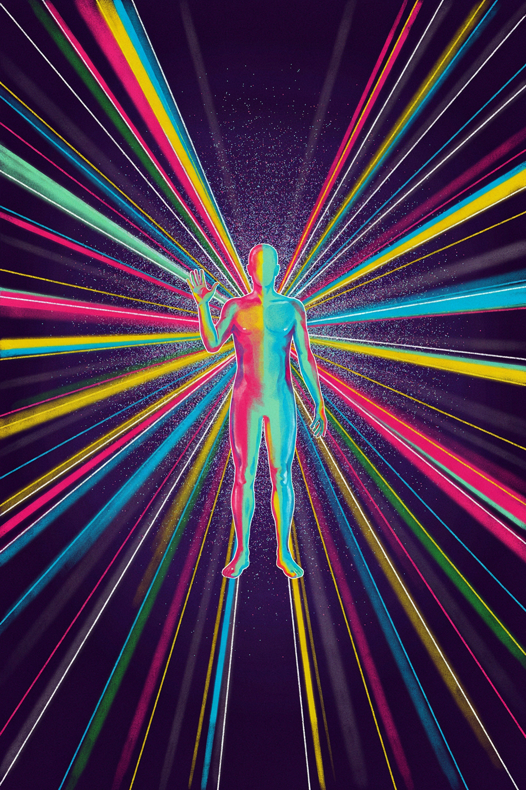
# Transformation

## Refracting

Crossing into the Spectrum is called **refracting**, and it is the same act as
morphing. One move, not two. You step sideways out of the everyday and you
arrive already changed, colour up, silhouette out, phrase already leaving your
mouth.

There is no ritual to learn and no gate to find. The seams are everywhere: a
bus shelter at the wrong time of night, the reflection in a shop window that
holds a half-second too long, the moment a stairwell light takes to come on.
Anywhere the everyday goes briefly uncertain about itself, you can lean on it,
and it gives.

What refracting costs and when you may do it depends on which of the three
gears you are using. There are exactly three, and this chapter is them.

## Solo Morph

You, on your own, out loud.

**Cost: 1 Sparkle** (the same Sparkle [Chapter 2](#how-to-play) tells you to spend freely; this
is the biggest thing it buys). Say your phrase. You arrive in the Spectrum transformed,
your Radiance unlocked, and you immediately **gain 2 Shine**, your track goes
to seven boxes for the duration and the two new ones arrive *filled*, not
empty.

**It ends** when the Gloom clock resolves, or at the Encore, whichever comes
first. Your Shine cap drops back to five then, and anything above it is gone.

Three limits, all of which exist because somebody would otherwise find the
loophole:

- **You can only be transformed once at a time.** Morphing while already
  transformed does nothing and costs nothing. You are already there.
- **You cannot revert early and morph again** to collect the Shine twice. Three
  Sparkle is not six Shine.
- **A Dimmed Star cannot morph.** Morphing requires you to be in the scene, and
  being Dimmed means you are not. There is exactly one way back from Dimmed and
  it is somebody coming to get you.

### Before the problem arrives

You may morph in the quiet opening of a Number, before anything has gone wrong.
Someone will want to, eventually, showing off in a kitchen, proving a point at
a bus stop.

When you do that, it is **purely descriptive**. No Sparkle. No Shine. No
Radiance abilities, no duration, and it does not count as having morphed. The
rainbow flares, everyone laughs, and it is over when the scene is.

This is not a punishment. It is so that you cannot arm yourself during the
calm and then arrive at the moment that matters unable to make the morph the
whole story is built around.

## Giving a morph airtime

When a Star morphs, **stop**.

The player narrates. Uninterrupted. Nobody rolls, nobody interjects, the
Showrunner does not describe the monster doing anything. However long they take
is how long it takes.

This is a rule, not a suggestion, and it is the rule most likely to be quietly
dropped by tables in a hurry. Do not drop it. The transformation sequence is
half of what this genre is *for*. A group that rushes through it to get to the
dice has bought the wrong game.

If a player is shy about it the first time, the Showrunner should ask two
questions and then get out of the way: *"What colour goes first?"* and *"What
do you say?"*

## Synchronized Morph

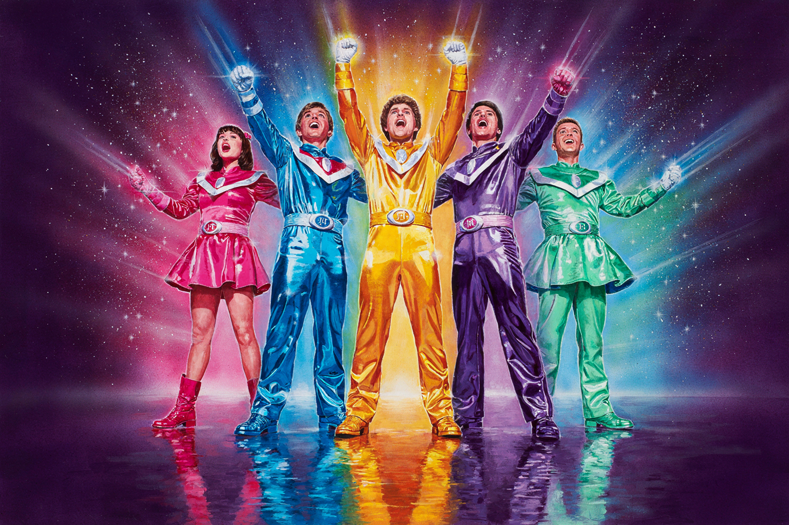

All of you, together, on the word you invented in [Chapter 3](#making-a-star).

**Cost: 1 Sparkle, paid in full by any single Star.** Not split, not shared, one person pays, and the whole team goes. Sparkle is never fractional.

That makes it cheaper for the group than everyone morphing solo, which is
deliberate. The game would like you to do this.

It unlocks every Star's Radiance, and three **shared abilities** that only
exist while the team is synchronized:

| Ability | What it does |
|---|---|
| **Formation** | Once per round, two Stars who have **both not yet acted this round** swap places in the turn order. Free, it costs position, not resources. Nobody gets a second action out of it. |
| **Chained backing** | A backer pays their cost **once**, and it covers backing two different rolls in the same round. It never puts a third die on one roll. |
| **Group finisher** | Two or more Stars each spend 1 Sparkle and act together. The Gloom removed doubles **once per participating Star**, two Stars quadruple it, three multiply it by eight. |

None of these adds a die or raises anybody's total. The numbers in [Chapter 2](#how-to-play)
hold exactly as printed.

**It ends** when the Gloom clock resolves or at the Encore.

## The Chord

The Combined Form has a key, and the key is made of **one note per Star**.
Five of you, five notes; three of you, three. The gate is that *everybody*
has sounded, not that any particular number has.

**Every Star is a note.** You **sound your note** the first time in a Number
that you do any one of these:

- **Back another Star at a cost.**
- **Have your Refrain cost you something.**
- **Get pulled back from Dimmed.**

One mark each. That is all: there is no way to sound the same note twice, and
no way to sound somebody else's for them.

**The Chord is full when every note is sounding.**

Keep it visible. A row of boxes in the middle of the table, one per Star,
filled in as the night goes. Players will start watching it without being told.

### What the Chord is actually for

It looks like a resource meter. It is not. It is a question the game asks the
table, roughly two hours in:

*Has everybody had their moment yet?*

Because the Combined Form, the big one, the thing the whole genre is pointed
at, will not open until the answer is yes. Not until the quiet player at the
end of the table has backed someone, or been reached, or held to their Refrain
and lost something for it.

This will make your group turn toward whoever has been silent. That is not a
side effect. That is the single most useful thing this book does, and it does
it without ever telling anyone to be more inclusive. It just makes the
spectacular thing require everyone.

**A team cannot combine until nobody has been left out.** That is the game's
entire argument, printed as a trigger condition.

## Combined Form

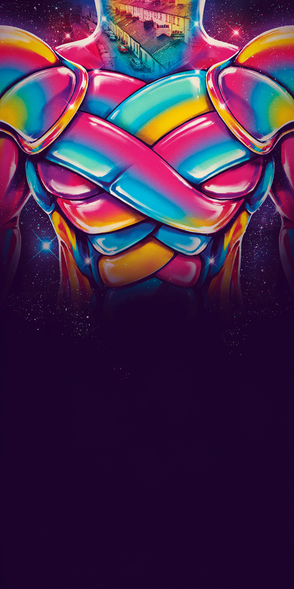

Rare, enormous, and the reason the Chord exists.

**Three conditions, all required:**

1. The team has made a **Synchronized Morph**.
2. **The Chord is full.**
3. You are in the **Big Finish**.

Then the team fuses. One sheet. One entity, described together, everybody
contributes an image and the Showrunner welds them into one thing that should
not fit through a doorway.

- **Traits**: the best of each Trait across the team, **capped at +2**. A team
  who chose different specialities becomes +2 in all four, which is better than
  any of you has ever been. A team who all picked the same +2 will have a
  Combined Form with holes in it, and that is a real consequence of how you
  built your characters rather than an oversight. Spread your +2s at creation
  if you care about this, and do not if you would rather have the characters
  you want.
- **Shine**: the **sum of everyone's current Shine**. A team that arrives
  battered fuses into something fragile; a team that arrives intact fuses into
  something enormous. You are as strong as whatever you have left.
- **Duration**: until the Gloom clock resolves.
- **When it ends**: divide the remaining Shine as evenly as possible among the
  Stars. The players choose who takes any remainder. Anyone who ends on 0 is
  **Dimmed**, and needs reaching like anyone else.

## Finishers

A **Finisher** is a transformed Star spending 1 Sparkle to hit properly.

It **doubles the Gloom your roll removes**. A Hit takes 2 instead of 1. A
Flourish takes 4.

The **Combined Form's finisher empties the clock outright.** It costs 1
Sparkle, paid by any single Star, chosen by the players, and if nobody has a
Sparkle left, it is not available and you win the ordinary way, one tick at a
time, which is its own kind of good.

Name your Finishers. Out loud, at volume, before you roll. The Showrunner
should never let one go past unnamed.

## A Chord filling

Here is a whole Number's worth of Chord, compressed, so you can see the rhythm
of it.

> **Verse.** Nothing has gone wrong yet. Danny asks Marisol what happened at
> her mum's, and Marisol, whose Refrain is *"I can hold this. Someone has to"*
>, says *"it's fine"* when it is plainly not. That costs her nothing, so no
> note sounds. The Chord is empty.
>
> **Chorus.** The bus takes the first swing. Wren goes for the doors and
> misses. Toby backs Priya's next roll and pays for it by shouting her name
> across a full pavement — **Toby's note sounds.** One of five.
>
> Marisol tries to hold a door open on her own, takes a Mixed, and the
> Showrunner offers Exposure: she has to admit she cannot do it alone. Her
> Refrain cost her something. **Marisol's note sounds.** Two.
>
> **Bridge.** Someone says the command word. Everyone morphs. Priya backs
> Wren, paying a Shine — **Priya's note sounds.** Three.
>
> **Big Finish.** Wren goes down to 0 and is Dimmed. Danny spends his action
> and 1 Shine to reach her, which sounds **both their notes at once**, his for
> reaching, hers for being reached. Four and five.
>
> The Chord is full. It is round three of the Big Finish, the clock is on two,
> and somebody says *"together?"*

Read that again and notice what was *not* required: nobody had to do anything
clever, or optimise anything, or remember a rule. Five people played their
characters honestly for two hours and the Chord filled itself.

That is the intended experience. If your table has to work at filling the
Chord, something has gone wrong upstream, usually that someone has not had a
scene of their own, which is the exact problem the Chord exists to make
visible.

## What refracting looks like

Some texture for the Showrunner, because "you cross over" is not enough to run.

The crossing is not a portal and not a flash. It is more like a key change: the
same street, one semitone up, and suddenly there is more of it. The colours
that were always in the light come apart and stand next to each other. The
launderette sign is still the launderette sign, but it is nine colours now and
two of them do not have names.

Sound arrives about half a second late, so there is a beat of total silence
after the phrase and before the world catches up. Use it.

Things in the Spectrum have the confidence of things that were always there.
The dolphins over the ring road do not react to you. The glitter that settles
on your shoulders is warm. Nothing over there is trying to convince you it is
real, which is precisely why it is unnerving the first time.

And it is *the same place*. Whatever the Star knows about the everyday version
still applies. The bus route still runs the way it runs. The library still has
a broken window at the back. That continuity is what makes winning matter: you
are not visiting a fantasy world, you are seeing your own one with the lid off.

## Which gear, and when

Three gears, one question each.

**Solo Morph** — *is this my moment?* Use it when the scene belongs to your
Star: when the thing in front of the group is yours to answer, or when you are
the only one still standing, or when you have just said something true and want
the world to change colour around you for saying it. It costs the most per
person and it buys the most attention.

**Synchronized Morph** — *is this our moment?* Cheaper for the group, and it
opens the shared abilities, so mechanically it is usually correct. But use it
when the fiction has earned a shout, not merely when it is efficient. A
Synchronized Morph is five people agreeing out loud at the same time; spend it
where that means something.

**Combined Form**: you do not choose this one. It arrives when the Chord is
full and the Big Finish is running and somebody looks up and says *"together?"*
If you find yourself planning it in advance, you are playing the wrong game
slightly. Let it be the thing that happens *to* you.

A useful default for a first Number: nobody morphs in the Verse, one or two
Solo Morphs when the Chorus goes badly, and the Synchronized Morph at the
Bridge as the answer to whatever the Chorus did to you.

## One last thing about the phrase

Say it every time.

Not a shortened version, not "I do my morph thing", the actual words, at
actual volume, every single time your Star refracts. It will feel silly in
session one and it will stop feeling silly somewhere in session two, and by
session three somebody at your table will get a genuine shiver when they hear
it, and that is the entire reason this game exists.

---

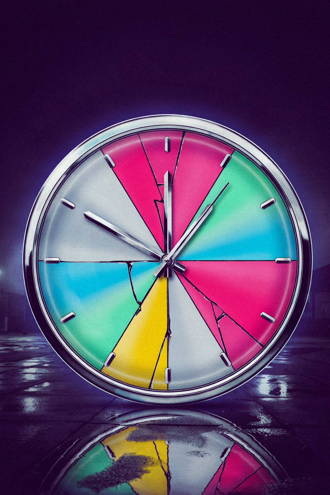
# Trouble

## Beating a Gloom

A Gloom is not a health bar. It is a **hold**, the grip that a piece of
neglect has on something that used to be cared for. The clock measures how deep
the grip goes, and you win by prising it off one finger at a time.

**The clock starts full.** Four segments, six, or eight, and every one of them
filled in before the first roll. That is how bad it already is. Nobody let it
get this way on purpose; that is rather the point.

| Your result | The clock |
|---|---|
| **Miss** | Gloom **+1** if there is room. If it is already full, **you lose 1 Shine instead.** |
| **Mixed** | Gloom **−1**, and you pay a cost |
| **Hit** | Gloom **−1** |
| **Flourish** | Gloom **−2** |

**Empty it and you win.** The shape comes apart, and back in the everyday the
thing it was holding comes loose: the route runs, the door opens, the person
picks up the phone.

**A Miss is never free.** Early in a Number the clock is already at maximum, so
a Miss has nowhere to add its tick, and a rule that did nothing there would
make missing *cheaper* than succeeding, since a Mixed always costs something.
So instead the Gloom pushes back on you. It has nowhere left to spread, so it
comes for your Shine.

**The Gloom never gets worse than it started.** A Miss's tick can restore lost
ground, but it can never take the clock past its starting size. The Gloom does
not escalate, plot, or adapt. It endures. That is what makes it Gloom rather
than a villain, and it is why the fight is always winnable and never quick.

### The last tick belongs to the climax

**A Gloom clock cannot be taken below 1 before the Big Finish.**

One sentence, and it does a lot of work. However well the Verse and Chorus go, however hot the dice run, however clever the plan, the killing blow waits for
the beat that was built for it. A team who tear through the early scenes arrive
at the Big Finish with the clock on one and every advantage; they simply do not
get to end the story in its second scene.

The Showrunner should say this out loud the first time it comes up, rather than
fudging a roll: *"That would take it to zero, so it stops at one, and it is
visibly barely holding. Save it."*

### Losing

The Gloom wins **only if every Star is Dimmed at once.**

Nobody dies. Nobody is maimed, captured, or written out. The team simply cannot
go on tonight. You come back to the everyday, and the thing you went for stays
grey, and somebody has to come back for it another time.

Let that be quiet when it happens. Do not stage a defeat cinematic. The right
note is five people on a pavement at two in the morning, and one of them saying
*"we'll come back."*

**If one result does both**, a last Star on 1 Shine rolls a Mixed against a
clock on 1, empties it, and the cost Dims them — **the team wins.** Emptying is
checked first. The Star goes down *as* the thing falls, which is the best image
this genre has, and they are still Dimmed when the Encore opens, and somebody
still has to reach them.

## Gloom clocks: size and setup

Three sizes. Pick by how much of the everyday is involved.

| Size | Scope | Example |
|---|---|---|
| **4** | A bad afternoon | One person forgotten for a week |
| **6** | A real problem | A cancelled bus route; a library cut to two days |
| **8** | A season's antagonist | A community centre being wound down by committee |

For a first Number use a **6**. Four resolves before the Bridge has landed;
eight is a long night unless the table already knows the rules.

Building one is [Chapter 7](#your-town-and-the-spectrum)'s job, but the question that sizes it is short:
**what does this neglect cost, and who pays?** If one person pays, it is a 4.
If a street pays, it is a 6. If it has a budget line and a review date, it is
an 8.

## Getting Dimmed

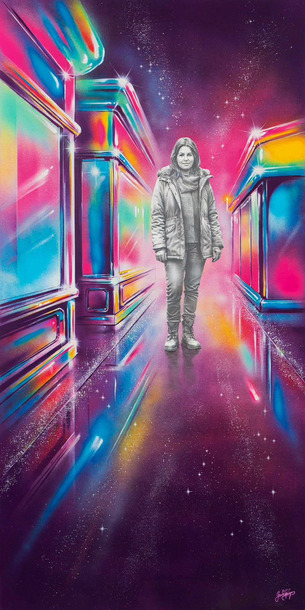

At **0 Shine** you are **Dimmed**.

You are still there. That matters. You are not unconscious and not removed: you are *greyed*, standing in the middle of the Spectrum with all the colour
gone out of you, able to see everything and do nothing. Your Radiance drops.
Your phrase will not come.

You cannot act, cannot roll, cannot back anyone, and, importantly, **cannot
morph**. There is no spending your way out of this. One Sparkle does not buy a
rescue.

Play it honestly. If your Star is Dimmed, say less. Let the silence sit. The
table will notice, which is the mechanism working.

## Reaching someone

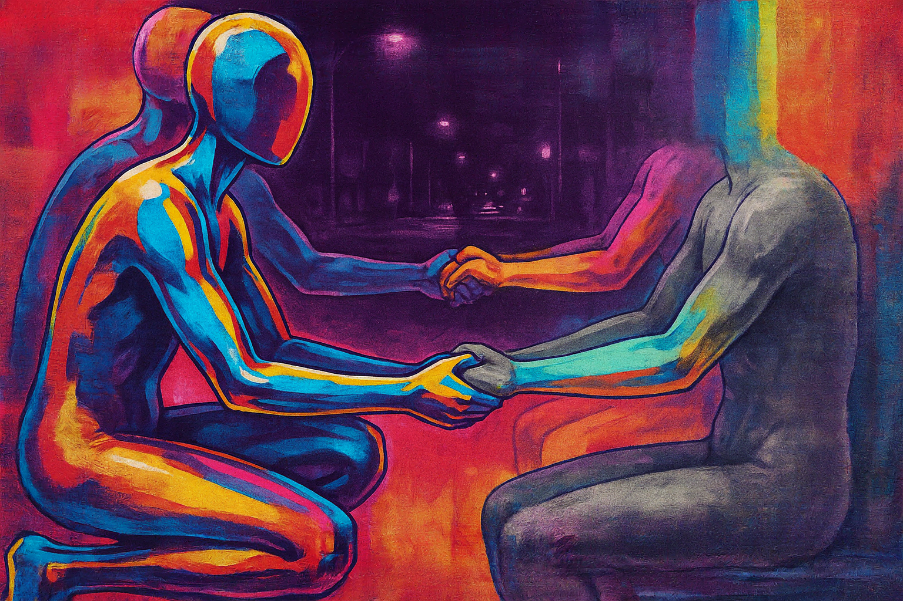

This is the best rule in the book, so it gets said plainly.

**Any Star can reach a Dimmed Star. It always works. There is no roll.**

The rescuer describes it, a scene, a truth, a hand held out, a name said
properly for the first time all night. Then:

- It costs the rescuer **1 Shine or 1 Sparkle**, their choice.
- **In the Big Finish**, it also costs their action for that round.
- **Outside the Big Finish**, where there are no rounds, it costs them the
  scene: they spend it going after the person instead of doing anything else.
- The Dimmed Star comes back with **2 Shine**.
- **The rescued Star's note sounds** on the Chord. The rescuer's does not:
  reaching someone is not one of the three things that sound your own note,
  and if it were, the Chord would fill a note early and open the Combined
  Form before everybody had actually had their moment.

No roll, ever. Not a hard one, not an easy one. In a game whose entire argument
is that people can reach each other, putting dice on the reaching would be
saying the opposite.

What the rescuer says matters more than what they spend. The Showrunner should
ask for it: *"What do you say to her?"*, and then wait.

## Chases, arguments, and other trouble

Everything uses the same roll. Only the fiction changes.

**A chase** is Flash if you are running, Craft if you are cutting the corner
they will not think of, Cool if you are simply refusing to hurry. Difficulty by
how far ahead they are.

**An argument** is Heart if you are being honest, Cool if you are being
composed, Craft if you are being right. Mixed results in arguments should
almost always cost **Exposure**, because that is what arguments do.

**A crowd** is Flash to move through, Heart to move, Cool to be believed by.

**A locked thing** is Craft, unless somebody has a more interesting idea, in
which case it is that.

The Showrunner does not need a subsystem for any of this. Name a Difficulty,
call for the Trait that matches how they are doing it, and apply the ladder.
PRISM has exactly one resolution mechanic and it is load-bearing everywhere.

## The Encore scene

Between Numbers, the lights come up. The Encore is short, quiet, and not
optional.

Go round the table. Each Star gets one scene, or one exchange, in the everyday, a kitchen, a bus stop, a doorstep, a stairwell at four in the morning. No dice.
No Gloom. Just people who did something enormous together, being ordinary near
each other.

Mechanically, the Encore does four things:

- **Shine refills completely**, for everyone, including anyone who ended Dimmed.
- **Sparkle refills completely**, up to your maximum.
- **Spent Bonds come back**, and every returning Bond gets **rewritten**,
  because something different is true now. This is the most important part.
  Read the old line, then write the new one, out loud.
- **The Chord clears.** Next Number, everybody starts silent again.

And two things that are not mechanical but matter more: check in on lines and
veils, and ask each player what they loved. Thirty seconds each.

## If you run a second Number

Here is the whole of advancement in PRISM. It is deliberately not a chapter.

**Your Traits never change.** Not ever. There is no experience, no levelling,
no way to buy your +0 up to a +1. A Star who has saved a town four times has
exactly the same numbers as one who has never left the bus stop.

That is genre fidelity, not laziness. The shows this game is made of do not
have characters who get statistically stronger; they have characters who get
*better known*. So what changes is everything that is not a number:

- **Bonds rewrite** at every Encore, as above.
- **Radiance evolves.** New colour in the palette, a new sound, a line added to
  the phrase. Free, unbounded, whenever it feels true.
- **Your Refrain may be rewritten**, but only once it has genuinely been
  tested. When a Star has held to their line at real cost, or broken it and had
  to live with that, they may write a new one. A rewritten Refrain is the
  clearest statement this game has that somebody grew.

There is exactly one number that moves. **Your maximum Sparkle rises by 1 after
every second Number, to a hard cap of 5.** It is the only growth in the game,
and it was chosen precisely because it touches no Difficulty, no ceiling, and
none of the probabilities in [Chapter 2](#how-to-play).

What a long-running PRISM group accumulates instead is a map. Not of a fantasy
world, of yours: a growing list of the things you have taken back. The 41 on
Fridays. The Tuesday reading group. The bottom of the river by the footbridge.
Keep that list somewhere everyone can see it, and add a line every time a clock
empties.

After a year of play, that list is your character sheet. It is longer than
anything a levelling system would have given you, and every entry on it is a
real place your friends can point at.

If your group wants more than that, you do not want more rules. You want
another Number. Go and pick a different thing in your town that somebody
stopped caring about.

## A Big Finish, end to end

The rules above, running once.

> **The clock is on 3.** The Nightline are transformed and it is round two.
> Wren is on 2 Shine, Toby on 4, Priya on 1, Marisol on 5, Danny on 3.
>
> **Wren** goes first. She wants to get between the thing and the last person
> on the pavement. Heart, and the Showrunner calls it **Tricky**. Danny backs
> her and pays 1 Shine (Danny to 2). Three dice: 5, 2, 6. Keep 6 and 5, that's
> 11, plus Heart +2 is 13. Beats 9 by four. **Hit.** Clock to **2**.
>
> **Toby** goes. He wants to get *under* it, which is Flash and, because it is
> loud and public and first, his Signature drops it a band: Dazzling becomes
> **Tricky**. He rolls 3 and 3 — 6, plus Flash +2 is 8. **Miss.**
>
> The clock is not full, so it ticks back up. Clock to **3**. The Showrunner
> describes the doors grinding open again.
>
> **Priya** is on 1 Shine and goes anyway. Craft, Tricky. She rolls 4 and 4:
> 8, plus Craft +2 is 10. Beats 9 by one: **Mixed**. Clock to **2**, and the
> Showrunner names the cost: **Exposure**, the thing she has been avoiding
> saying about her hands shaking.
>
> **Priya's player:** No. I'll take the Shine instead.
>
> She can always do that. Priya to 0.
>
> **Priya is Dimmed.** She stands there in the middle of it with the yellow
> gone out of her.
>
> **Marisol** spends her whole action reaching her. It costs her 1 Shine
> (Marisol to 4). No roll, it simply works. She says: *"Breathe. I've got the
> door."* Priya comes back with **2 Shine**.
>
> And Priya's note sounds, for being reached. Marisol's does not; reaching
> somebody is not one of the three things that sound your own note. Marisol
> sounded hers earlier tonight. **The Chord is full.**
>
> **Danny**, last in the round, looks at the clock on 2 and at four people who
> are all still standing, and says: *"Together?"*

Everything in this chapter is in that exchange: a full clock ticking back up on
a Miss, a Mixed that succeeded and hurt, a Dimming that was not a death, a
rescue with no dice on it, and two notes sounding at once because somebody went
and got their friend.

## What the Showrunner is doing during all this

Three things, and no more.

**Name the Difficulty before the dice.** Out loud, and then do not move it. If a
player argues for a lower one, listen before they roll and not after.

**Make a move on every Miss.** The default is the clock. When the clock is full
and it comes off the Star's Shine instead, describe *why*, the Gloom turning
its attention, the cold coming off it, the sheer weight of being near a thing
that does not care.

**Ask for the words.** On a rescue, on a morph, on a Refrain that just cost
somebody something: *"What do you say?"* Then wait. The waiting is the job.

You are not adjudicating a combat. There is one mechanic, it fits on a card,
and your actual role is to keep asking people what they said out loud.

## When not to roll

Trouble is not the same as dice. Do not reach for them when:

- **Nothing is at stake.** If the Star wants to do it and failing would just be
  an inconvenience, they do it.
- **A Star is reaching a Dimmed friend.** Never. Not once. Not even when it
  would be dramatic.
- **Somebody is telling the truth about themselves.** Sincerity is not a
  contested action in this game. If a player says their Star finally admits the
  thing, the Star admits the thing.
- **The answer is obviously yes and the fun is in the description.** Let them
  describe it and give them the win.

Roll when the outcome is genuinely uncertain *and* you can name what a Miss
would change. If you cannot say what a Miss does before the dice go down, you
do not need the dice.

---

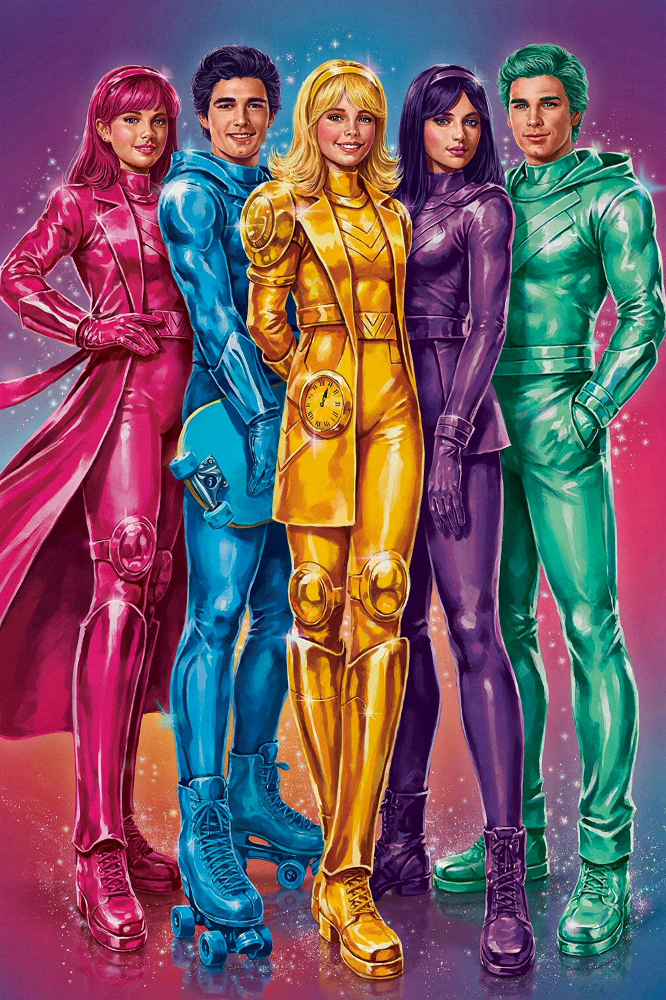
# Five Stars, Ready to Play

## How to use these

Pick one. Play tonight.

These five are finished. Traits, Refrain, Signature, Look, Radiance, and every
Bond already written between them. They are built as a team called **The
Nightline**, and [Chapter 10](#the-first-number)'s starter Number is written for exactly these
people.

Everything here is yours to change. Swap a name, move a Trait, rewrite a Bond
that does not sound like you. The only thing worth keeping intact is the Bond
*web*, those lines connect to each other, and pulling one loose leaves a gap
somebody will need in the Big Finish.

If you are using all five, hand them out and read your Refrain aloud in turn.
That is your whole session zero.

Every Star starts with **Sparkle 3** and **Shine 5**.

---

## Wren Adeyemi (magenta)

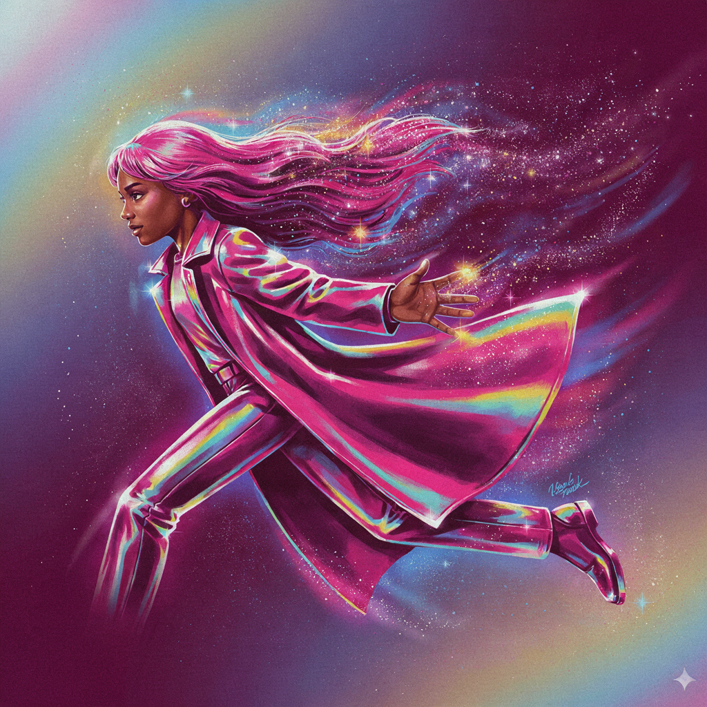
**Heart +2 · Flash +1 · Craft +1 · Cool +0**

**Refrain:** *"I don't leave people in the dark."*

**Signature. The one who goes back.** Drops a band on any roll to reach,
retrieve, or refuse to abandon someone.

**Look:** Enormous second-hand parka, sleeves over the hands. Phone at 4%
permanently. Walks fast and keeps checking behind her that everyone is
following.

**Radiance:** Magenta and chrome. A coat that trails behind her like a comet
and throws off sparks that do not go out when they land. Sound: one sustained
chord, low, the kind that makes a room feel bigger. She holds nothing, her
hands stay free, deliberately, because they are for other people.

> *"Nobody stays behind."*

**Transformed:** She always knows the direction of the person who most needs
finding.

**Bonds**
- *To Toby:* You made me laugh at my nan's funeral and I have never told you
  how much that helped.
- *To Priya:* You fixed my bike at midnight and would not let me pay you.
- *To Marisol:* I have seen you hold it together twice and I do not think
  anyone else noticed either time.
- *To Danny:* You asked me twice. Nobody asks twice.

**Playing her:** Wren is the engine. She will get the group moving and she will
go back for people at cost to herself. Cool +0 means she is terrible at being
calm about it, she cannot bluff, cannot wait, cannot pretend it is fine. When
the answer is patience, she needs someone else.

---

## Tobias "Toby" Lark (cyan)


**Heart +0 · Flash +2 · Craft +1 · Cool +1**

**Refrain:** *"Somebody has to be ridiculous first."*

**Signature. Opening act.** Drops a band when doing something publicly,
loudly, and first.

**Look:** Board under one arm at all times, including indoors. Three jackets in
rotation, all bad. Talks continuously and says very little.

**Radiance:** Cyan and holographic, an oil-slick shimmer that changes with the
angle. Skates that leave a gradient hanging in the air behind him for a second
and a half. Sound: a single wheel spinning down. The board is the object, it
was his brother's, and it still has his brother's stickers on it.

> *"Watch this bit!"*

**Transformed:** He can ride any surface, including ones that are not there.

**Bonds**
- *To Wren:* You never once asked me to calm down.
- *To Priya:* You explained it four times without getting bored and I still
  don't get it, but I liked the fourth time best.
- *To Marisol:* You are the only person who knows I am frightened of it.
- *To Danny:* You heard what I actually said, that time, and not what I said.

**Playing him:** Toby goes first. That is his function and his Signature. Heart
+0 is the interesting part, he cannot do sincerity, it comes out as a joke
every time, and the group needs him to manage it exactly once a session and
watch it be hard.

---

## Priya Raghunathan (sunburst yellow)

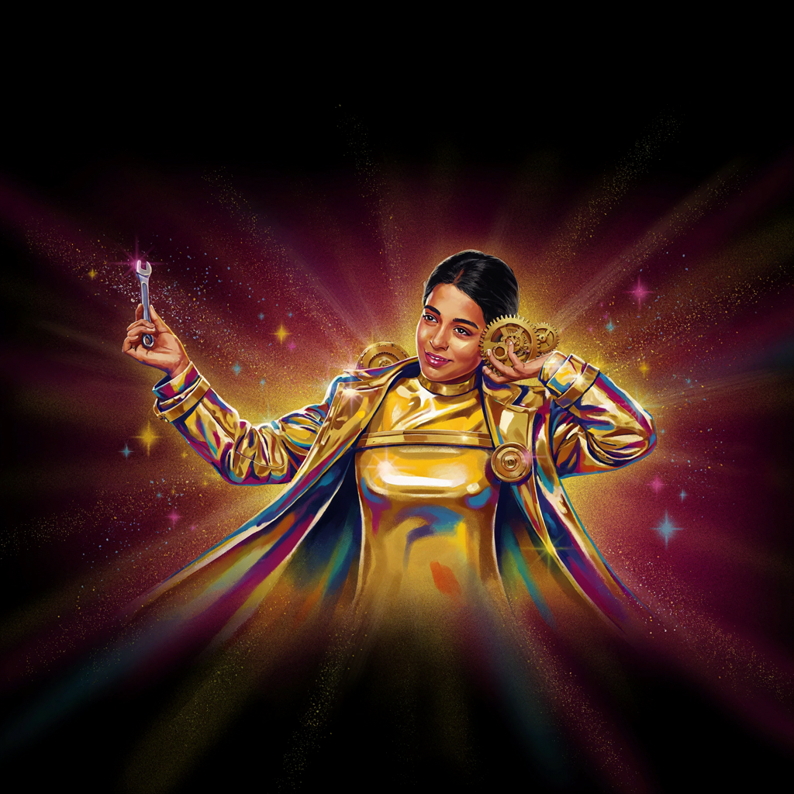
**Heart +1 · Flash +0 · Craft +2 · Cool +1**

**Refrain:** *"If it's broken I want to know why."*

**Signature. Takes it apart.** Drops a band on understanding how a thing, or
a Gloom, actually works.

**Look:** Boiler suit with the sleeves cut off. Pockets full of components that
are not hers. Always faintly covered in something. Reading glasses she denies
needing.

**Radiance:** Sunburst yellow and brass. A coat made of working clockwork, gears
visibly turning at the shoulders and hem, keeping a time that is not quite ours.
Sound: brass settling, a set of small mechanisms finding their places. She
carries a wrench that was her first ever tool and is far too small for anything.
There were two of them in the set. She has never mentioned where the other one
went.

> *"Show me the seams."*

**Transformed:** She can see how anything was assembled, including people,
including Glooms.

**Bonds**
- *To Wren:* You waited outside the exam hall for two hours in the rain.
- *To Toby:* I have watched you fall over eleven times and get up eleven times
  and I think about it more than you would believe.
- *To Marisol:* You said my name right the first time and corrected someone
  else about it later.
- *To Danny:* I told you the real reason and you did not do anything with it.
  You just knew.

**Playing her:** Priya stops to look at the thing. That is the Refrain, and it
will cost the group time at least once a night, which is exactly the point,
because it is also her Sparkle income. Flash +0 means she cannot outrun
anything, ever, and knows it.

---

## Marisol Vega (violet)

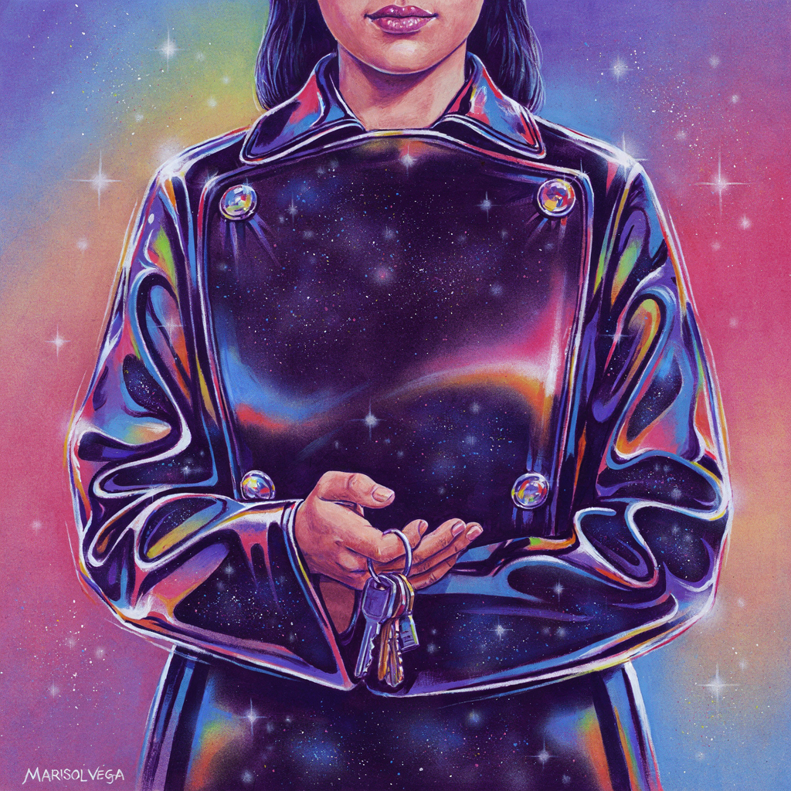
**Heart +1 · Flash +1 · Craft +0 · Cool +2**

**Refrain:** *"I can hold this. Someone has to."*

**Signature. The steady one.** Drops a band on staying calm where calm is the
hard thing.

**Look:** Immaculate. Uniform still ironed at the end of a shift. The stillest
person in any room, which reads as confidence and is not.

**Radiance:** Violet and starfield, not stars printed on cloth but actual
depth, as though the Spectrum thinned out where she stands and let something
enormous through. Sound: almost none. A held breath. She carries her mother's
door keys, and they are the only part of her that makes a noise.

> *"Breathe. I've got the door."*

**Transformed:** Anything she holds shut stays shut.

**Bonds**
- *To Wren:* You noticed. You did not say anything, and you noticed, and that
  was the right order.
- *To Toby:* You are the only thing in my week that is not a responsibility.
- *To Priya:* You asked me a question about me and then waited for the answer.
- *To Danny:* **(unwritten)** — these two have not had the conversation yet.
  Leave this blank until they do. Marisol cannot back Danny, and Danny cannot
  back Marisol, until somebody at the table says the thing out loud. This is
  the honesty rule from [Chapter 2](#how-to-play), deliberately live in your first session.

**Playing her:** Marisol is the one holding the door, literally and otherwise.
Her Refrain will get her hurt, because she will keep saying she can hold it
after she cannot. Craft +0 means she has no idea how anything works and will
not pretend to.

---

## Danny Okonkwo-Byrne (mint green)


**Heart +2 · Flash +0 · Craft +1 · Cool +1**

**Refrain:** *"You can tell me the bad version."*

**Signature. Hears it.** Drops a band on getting someone to say the true thing
out loud.

**Look:** Cardigan with something in every pocket. Sits down when other people
are standing. Owns an actual paper notebook and writes in it in front of you,
which people find either lovely or unbearable.

**Radiance:** Mint green and pearl, a soft glow with no obvious source that
makes the air around him feel like a small room. Sound: two beats of a song
nobody else can place. No object, he keeps his hands in his pockets, and
somehow that is the most transformed thing about him.

> *"Go on. I'm still here."*

**Transformed:** Anyone who speaks to him tells the truth, and is not hurt by
having done so.

**Bonds**
- *To Wren:* You came back for me when there was no reason to think I was still
  there.
- *To Toby:* I know what the jokes are for.
- *To Priya:* You gave me the wrench. You said it was spare. It was not spare.
- *To Marisol:* **(unwritten)** — see her entry. Write this one at the table.

**Playing him:** Danny gets the truth out of people, which makes him the engine
of half the Bonds and most of the Chord. Flash +0 means he arrives last at
everything. His Refrain will cost him, because people tell him the bad version
and he has to carry it.

---

## The team's Bonds and command word

**The Nightline.** They named themselves after the bus, which is either
sentimental or a bit much depending on who you ask, and all five of them like
it.

Look at the Bond web above and notice that it is not symmetrical. Marisol has
not told Danny yet. Danny is waiting. Toby's Bonds to everyone are the
lightest, because Heart +0, and his Bond to Marisol is the exception that
proves he can, when it matters.

That asymmetry is the good part. Do not tidy it up.

**Playing with three?** Use Wren, Priya and Marisol. That keeps a **+2 in
Heart, Craft and Cool** and leaves Flash as the gap, with nobody above +1,
which makes chases genuinely frightening and is more interesting than it
sounds. It also cuts the Bond web to six lines: delete the Bonds to Toby and
Danny and leave the rest.

Dropping Danny takes Marisol's unwritten Bond out with him, so a three-player
game starts with a complete web. If you would rather keep the rule visible,
leave one Bond of your own blank and fill it at the table.

**The command word:**

> **"PRISM — SPLIT THE LIGHT!"**

All five, out loud, at the same time. Practise it once before you start, so the
first time is not the real time.

---

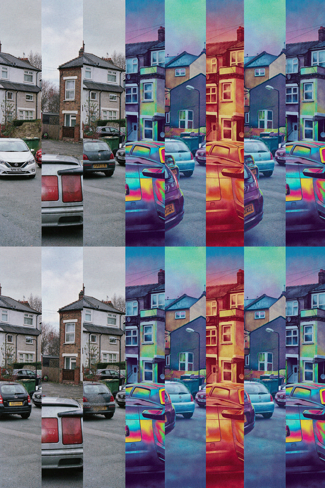
# Your Town and the Spectrum

## The everyday

The setting of PRISM is the place you actually live.

Not a version of it. Not a lightly fictionalised one with the street names
changed. Your town, with its actual bus routes and its actual weather and the
shop that has been "closing down" for four years.

This is a deliberate refusal. PRISM ships no world map, no gazetteer, no
timeline of Great Events, and no canon you could contradict. What it ships
instead is a **procedure**, a way of looking at where you already are until
you find the thing worth fighting for. That procedure is this chapter, and it
is most of what the Showrunner actually needs.

The everyday is not drab. Be careful of that. It is not a grey world that the
Spectrum redeems. It is simply the world with all its colour still folded up
inside it, the way white light carries every colour at once and shows you
none of them. Nothing is missing here. It is all present and unsplit.

There is no masquerade. Nobody is hiding anything from the general public,
because there is no secret to keep: the Spectrum is not classified, it is just
not somewhere most people have thought to step. Your Stars have ordinary lives,
ordinary names, and ordinary jobs, and nobody will section them for saying
where they were last night.

## The Spectrum

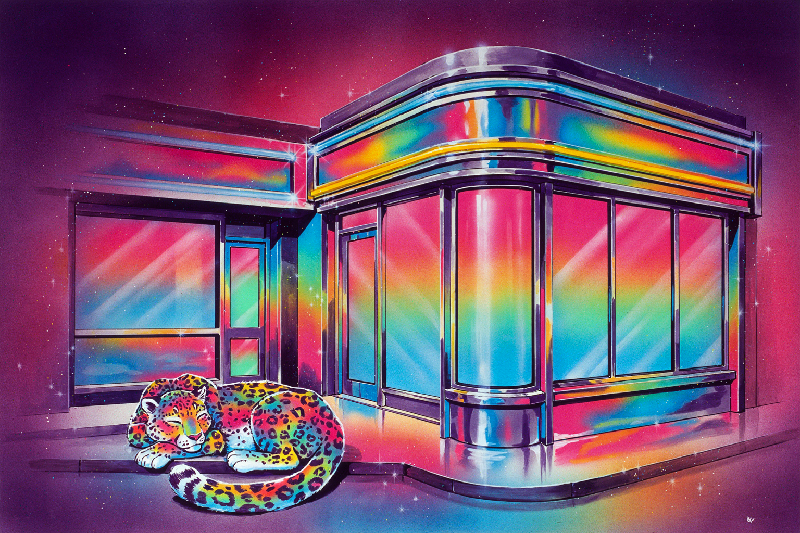


One turn to the left, and the light comes apart.

The Spectrum is the same geography rendered in howling airbrushed rainbow. The
same launderette on the same corner, but the sign is nine colours now, two of
which do not have names, and the letters have a chrome bevel that catches light
from a sun that is not in the sky.

Some things that are reliably true over there:

**Gradients happen to everything.** Skies, walls, water, the backs of hands.
Nothing is one colour. Nothing is ever one colour.

**Chrome and neon are structural.** Not decoration, load-bearing. Railings,
bus shelters and lamp posts are all mirror-finished and all reflecting a
slightly different scene than the one in front of them.

**Impossible animals are ordinary.** Dolphins moving through the air above the
ring road. A snow leopard on a roof, in space, somehow, without the roof
stopping being a roof. They do not react to you. They are not a portent. They
live here.

**Glitter behaves like weather.** It drifts, settles, banks up in doorways, and
is warm to the touch. It will be in your Stars' pockets for days.

**Sound arrives half a second late.** This is the single most useful trick for
running the place: after somebody says their phrase, there is a beat of total
silence before the world catches up. Use that beat.

And crucially — **it is the same place.** Everything a Star knows about the
everyday version still holds. The route still runs where it runs. The library
still has the broken window round the back. Winning here changes things there,
because there is no *there*: it is one location seen two ways.

## What the Gloom is

Something in your town has stopped being cared for.

Not attacked. Not cursed. Just, allowed to slide. A service quietly reduced. A
building nobody has the budget for. A person nobody has rung. The specific,
ordinary, entirely human process by which good things get dimmer because
looking after them was somebody's job and then it was nobody's.

In the everyday, that looks like a form, or a shrug, or a notice on a door.

In the Spectrum, it has a body.

**The Gloom does not want anything.** This is the most important sentence in
the chapter. It has no plan, no goal, no ideology, and nothing to negotiate
with. It is not evil and it is not even hostile in the way a villain is
hostile. It simply keeps taking, the way a low place keeps collecting water,
because that is the shape it has.

That is the horror of it, and it is also exactly why you can beat it. A thing
with no plan cannot adapt to yours. It endures; it does not escalate. Five
people who have decided to care about something, on purpose, at cost, are the
one thing it has no answer for.

## Turning a real problem into a Gloom

Five steps, **about ten minutes**. That number matters: a Showrunner who thinks
this is an evening's worldbuilding will never do it, and the whole design
depends on it being something you can do on the bus on the way to the session.

Once you have it you never need this book to invent an antagonist again.

### 1. Name a real local problem

Small and specific. Resist the urge to go large.

**Good:** the night bus that stopped running. The library open two days a week.
The pool that closed. The friend nobody has checked on. The stretch of river
that nobody clears.

**Bad:** urban decay. Austerity. Loneliness. These are true and they are
unfightable, and a monster made of them will be a fog rather than a thing.

The test: **can a Star point at it?** If they can walk to it and put a hand on
it, you have a Gloom. If they can only gesture at it, go smaller.

### 2. Ask what it costs, and who pays

This is the Gloom's diet, and it decides everything downstream.

The night bus does not cost money. It costs a particular kind of evening, the
one where you stay out because you can get home. It is paid for by the people
who now do not go, and who do not entirely notice they have stopped.

Write one sentence: *"This costs ______, and ______ pays it."* You will use it
in the Big Finish.

### 3. Build the Spectrum body

Now make it a thing.

Take the everyday form and ask what shape that neglect would have if it were
enormous and patient. The bus that stopped running becomes a bus the length of
a street, chrome and rust, headlights like dead suns, and: this is the part
that makes it a Gloom rather than a monster — **always pulling away.** Never
arriving. Never chasing. Just leaving, forever, with the doors closing.

Three rules for the body:

- **It should be recognisable.** Somebody should be able to guess the everyday
  problem from the Spectrum shape.
- **It should not be trying to hurt anyone.** It hurts people the way weather
  does.
- **It should be doing one thing forever.** Pulling away. Filling up. Getting
  quieter. Offering to do it for you.

### 4. Size the clock

**4** if one person pays. **6** if a street pays. **8** if it has a budget line
and a review date.

Then write three **moves**, the things it does on a Miss. Not attacks. Things
it *does*, which happen to cost you.

> *Strand someone. Make the distance longer. Convince them it was always like
> this.*

### 5. Decide what comes back

Finish before you start. Write the one concrete, small, specific thing that is
different in the everyday when the clock empties.

Not "hope returns to the neighbourhood". **The route runs again on Fridays, and
two people who had stopped seeing each other are on it.**

That sentence is the reward for the whole Number, and the Stars should hear it
in the last thirty seconds of the session, and it should be worth the evening.

## Four worked examples

Models, not canon. These four are *different* from the six with full stat blocks
in [Chapter 9](#the-gloom), so between the two chapters you have ten to steal from. Take the
shape and change the details to your own town.

**The Understair** (clock 4). A food bank moved from the church hall to a
cupboard behind the sports centre, with no sign on the door. In the Spectrum: a
corridor that is always slightly narrower than the thing you are carrying, lit
by one strip light that is always about to go. It costs dignity, and the people
who need it most pay in full. When it falls: there is a sign, at eye height, in
ordinary type, saying what it is and when it is open.

**Just Us Two** (clock 6). Two friends who used to be
part of a bigger group and now only ever see each other. Not a falling-out;
everyone simply stopped organising. In the Spectrum: a beautifully appointed
room for exactly two, which politely rearranges its own doors so that nobody
else ever quite arrives. It costs everyone who was not in the room. When it
falls: somebody makes a group chat with nine people in it, and four of them
reply the same evening.

**The Long Grass** (clock 6). A patch of green between two estates that was a
football pitch and is now a place people apologise for walking through. In the
Spectrum: grass that grows to exactly the height at which you would rather go
round, and does not grow any higher, and never stops. It costs a shortcut and a
meeting place; the two estates pay it separately without noticing they are
paying the same bill. When it falls: a path appears because people walk it.

**Vending** (clock 8). A hospital's out-of-hours provision, gradually replaced
with machines. Nobody decided this either. In the Spectrum: an endless bank of
softly humming vending machines, all lit, all stocked, all perfectly functional,
in a corridor where there used to be a desk with a person behind it. It costs
the question you would have asked if there had been anyone to ask. When it
falls: there is a chair, and somebody sitting in it, and they look up.

*Vending is the one closest to real distress. Ask before you use it.*

## Your town is the real setting

Those four are scaffolding. Take them down.

The best PRISM Number your table will ever play will be about something one of
you is genuinely annoyed about, a thing you walk past, a thing that closed,
somebody you have been meaning to ring. Ask at the start of a session: *"what's
been allowed to go grey near you?"* and then build the monster out of the
answer.

One caution, and it belongs here rather than in the safety chapter because it
is a craft note as much as a care note: **ask before you build a Gloom from
something close to somebody's actual life.** A hospital one, a benefits one, a
someone-in-this-room-is-burning-out one. Thirty seconds of asking buys you the
whole evening.

Then go and win it back.

## Running a scene in the Spectrum

Some practical notes, because describing a place this loud gets tiring fast.

**Name three things and stop.** One colour, one impossible object, one sound.
Not a paragraph. *"The launderette sign in nine colours, a snow leopard asleep
on the roof, and the hum arriving a half-second after you see the light."* The
players will build the rest and theirs will be better.

**Let the Stars add to it.** Ask directly: *"What's over there that shouldn't
be?"* Anything a player invents is now true. This is the fastest way to make
the Spectrum feel inhabited rather than performed, and it costs you nothing.

**Keep one everyday thing in frame.** A bin. A bus stop. A specific broken
paving slab. The Spectrum is disorienting precisely in proportion to how much
of the ordinary world is still recognisably in it, and a scene with no anchor
becomes a light show.

**Never explain it.** Nobody in the fiction knows why any of this works, the
Stars least of all. There is no lore to uncover, no origin, and no one to ask.
If a player theorises, let them be right for the evening and do not confirm it.

## The rule about coming back

Whatever happens in the Spectrum, the Stars come home.

Not as a mercy, as a structure. Every Number ends in the everyday, on the same
street, at roughly the same time of night, with the ordinary world very
slightly changed. That return is where the reward lands, and skipping it to end
on the big fight is the single most common way to waste a good session.

Give it thirty seconds. Describe the ordinary thing that is now different. Let
somebody notice glitter in a coat seam. Then stop.

---

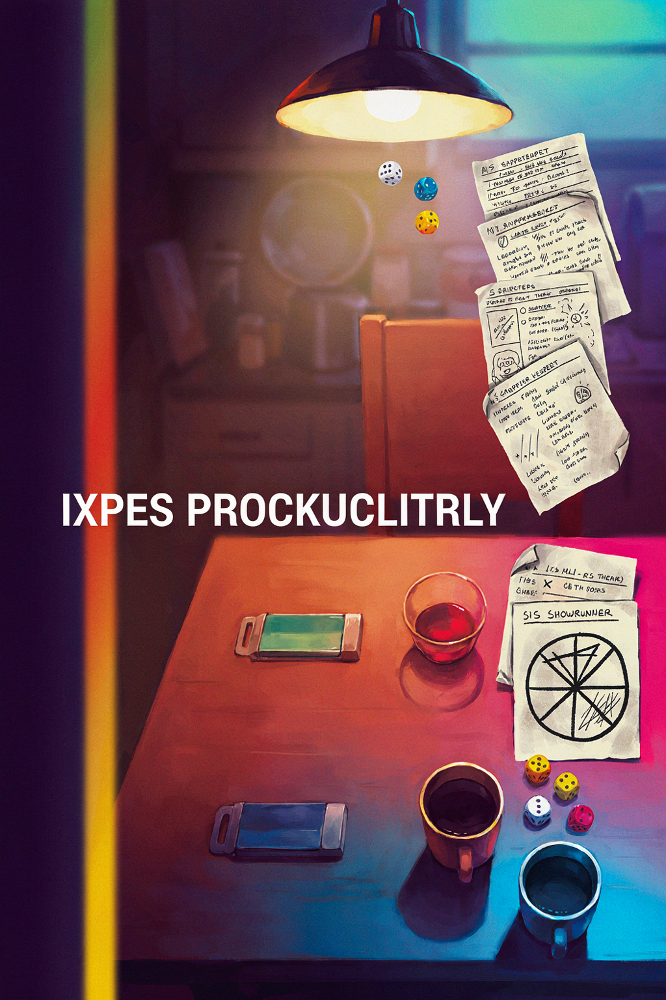
# Running the Game

## What the Showrunner does

You do three things.

**You describe the situation.** The everyday first, honestly and specifically,
and then the Spectrum when they cross. You are not a narrator of plot; you are
the person who says what it looks like and then shuts up.

**You name the Difficulty, before the dice.** Out loud, once, and then you do
not move it. If a player wants to argue for a lower one, they get to do that
before they roll and not after.

**You ask for the words.** This is the job. When a Star morphs: *"What do you
say?"* When someone reaches a Dimmed friend: *"What do you say to her?"* When a
Refrain has just cost somebody something: *"Say it to him."* Then you wait. The
waiting is not dead air. The waiting is the game.

And two things you never do:

**You never kill a Star.** Not as a twist, not as a consequence, not with
permission. The floor of this game is that people go dim and get reached, and
the moment that floor is not solid, players stop investing in the sincerity the
whole thing runs on.

**You never refuse a rescue.** Reaching a Dimmed Star always works. There is no
circumstance, no special Gloom, and no dramatic moment that makes it fail.

## Building a Number

A Number is one session and one complete story. Here is the prep, and it should
take about fifteen minutes.

**1. Pick the thing.** [Chapter 7](#your-town-and-the-spectrum)'s procedure. A real local problem somebody can
point at. If your players have been playing a while, ask *them* at the end of
the previous session and prep the one they name.

**2. Build the Gloom.** Everyday form, Spectrum body, three moves, clock size,
and the one concrete thing that comes back.

**3. Find the Bridge.** This is the only genuinely hard bit of prep, and it is
worth the time: **what is the truth that has to get said?**

Every Number has one. Somebody has to admit something, or ask for something, or
stop pretending. You do not need to know who says it, the table will decide
that, but you need to know roughly what it is, because that is the moment the
whole shape hinges on.

The hinge for each Gloom in [Chapter 9](#the-gloom):

| Gloom | The truth that has to get said |
|---|---|
| The Last Bus | *"I stopped going out and I didn't notice."* |
| The Quiet Shelf | *"That was the only warm place I had."* |
| The Silt | *"I walk past it every day. I've never once stopped."* |
| The Long Weekend | *"I assumed someone else had rung."* |
| The Grey Ledger | *"I filled in the form because it was easier than arguing."* |
| The Understudy | *"I think you'd all be fine without me."* |

Notice that every one is an admission rather than a discovery. The Bridge is
never a clue the Stars find; it is a thing one of them stops not saying.

**4. Write five hooks.** One per Star, straight off their sheets, a place
their Refrain gets tested, a thing their Signature is for, a Bond that could
come due. One line each. You will use three of them.

**5. Do not plan the middle.** You have an opening, a monster and a hinge. The
middle is theirs.

## The four beats in practice

### Verse, the everyday

Open in the ordinary world and stay there longer than feels comfortable.

This is the beat new Showrunners rush and it is the one that makes the rest
work. Spend real time on a kitchen, a shift, a bus stop, a group chat. Let the
Stars be people with lives. Ask small questions: what are you eating, who
texted you, what did you not do today that you meant to.

The problem arrives at the *end* of the Verse, and ideally it arrives as
something small and wrong rather than an attack. The bus does not come. The
door is locked when it should not be. Somebody does not reply.

**If the Verse runs long:** good. Let it. Cut in with the problem when the
energy dips, not on a schedule.

**If the Verse runs short:** the players are keen for action and you should give
it to them, but ask one question of each Star before you do.

### Chorus, it goes badly

First contact. They engage, and it does not work, and the clock is revealed for
what it is: **already full.**

The Chorus exists to establish that this cannot be solved by ordinary
competence. Let them try the sensible thing. Let the sensible thing be
insufficient. Nobody should morph here, or if somebody does, that is the
Bridge arriving early and you should treat it as such.

**If they are winning too easily:** remember the clock cannot go below 1 before
the Big Finish, and say so out loud rather than fudging.

### Bridge, the key change

Somebody says the thing. Then everybody morphs.

You cannot script this. What you can do is *make room for it*: cut away from
the action, put two Stars alone somewhere, and ask the question you wrote in
prep. *"You've got about thirty seconds before it comes back. What do you tell
her?"*

Then the command word, and the airtime rule, and no dice at all until it is
finished.

### Big Finish (transformed)
Turn order starts here and only here. Go round the table, one action each per
round, Showrunner acting between rounds.

Track two numbers where everyone can see them: the clock, and everybody's
Shine. That is the whole tension. Say the clock out loud every time it moves.

Watch the Chord. When it fills, do not announce it, let a player notice. They
will, and the moment somebody says *"…wait, are we all…?"* is the best moment
in the game.

## Making the Bridge land on time

The commonest way a PRISM session goes wrong is the Bridge never arriving. The
group stays in problem-solving mode, nobody says anything true, and you end up
in a long Chorus that gradually stops being fun.

Four tools:

**Separate them.** Two Stars alone in a stairwell will say things five Stars in
a fight will not.

**Ask directly.** You are allowed. *"Marisol, you've said 'I've got it' four
times tonight. Is that true?"*

**Make the ordinary approach fail once more.** Not punitively, just enough that
someone says *"we can't do this the normal way."*

**Have an NPC say a smaller version of it.** Somebody the Stars are helping,
admitting something minor. It gives the table permission.

And if a player morphs early? It depends on whether there is anything to morph
*at* yet.

**Once the problem is on the table**, which is the end of the Verse at the
latest, **that morph is the Bridge.** Do not block it. Roll with it: the key
change came early, so move the Number toward its Big Finish from there. If no
Gloom clock is running yet, the morph starts one, a transformation is itself a
declaration that something is wrong.

**Before the problem arrives**, in the ordinary-life opening, it is not a
transformation at all, just a flourish of light. It costs nothing, grants
nothing, and does not count as having morphed. Let them show off, and do not
start a clock for it.

## Showrunner moves

On a Miss, you make a move. **The Gloom's own three moves come first**: every
entry in [Chapter 9](#the-gloom) carries three, they are specific to that monster, and they
are always the better choice when one fits. This list is the fallback for when
none of them does.

**The mechanical consequence is not optional.** Every Miss advances the Gloom
clock by 1, or, if the clock is already full, takes 1 Shine from the Star
instead. That happens on every single Miss and it is the whole of the
mechanical move.

What you choose is the *fiction that carries it*. Pick one, and make it change
the situation:

- **One of the Gloom's three moves.** Always the first place to look, because
  they are specific to this monster. Strand someone. Make the distance longer.
  Convince them it was always like this.
- **Separate them.** Distance is the Gloom's favourite weapon.
- **Take something small away.** The phone, the light, the route back.
- **Offer them an easier thing.** Let them out. Let them stop. Make it genuinely
  attractive.
- **Show them what it costs.** Cut to the person who is paying.

Never: hurt a Star permanently, kill anyone, or take a Star's turn away.

**One Miss, one tick, one image.** Do not take the Shine *and* advance the
clock, and do not stack two of the images above onto the same Miss.

## Tone dials

Three, and you should set them out loud in session one.

**How bright?** The default is very. Some tables want the Spectrum uncanny
rather than joyful, colours slightly too loud, glitter slightly too warm. Both
work. Say which you are doing.

**How sincere?** The default is completely. A table that jokes constantly is
usually nervous rather than uninterested; give them one quiet two-person scene
and the register will find itself.

**How much everyday?** The default is about half. Groups who love the Verse can
run whole sessions where the Spectrum appears once, at the end, for ten
enormous minutes. That is a legitimate way to play PRISM and often the best one.

## Common table problems

**Somebody has not spoken in an hour.** The Chord is already working on this, their note is unsounded and the group will need it. But do not wait for the
mechanic. Cut to them. Give them a scene with one other Star and a question.

**The table will not be sincere.** Do not push against the jokes directly. Take
two Stars aside, drop the volume, ask something small and specific, and wait
longer than is comfortable. Sincerity needs a quiet room more than it needs
encouragement.

**They solved it too fast.** They cannot, the clock will not go below 1 before
the Big Finish. Tell them so, and let the last tick be the climax.

**A player wants their Star to die heroically.** No. Offer instead: they are
Dimmed at the moment of victory, and somebody has to come and get them, and
that scene is the last one of the Number. It is better and they will agree
afterwards.

**Nobody is backing anybody.** Usually means the Bonds are thin. Call an
unscheduled quiet scene, put two Stars in it, and ask what actually happened
between them.

## NPCs, and how little they need

People in a PRISM Number do not get stat blocks. They do not roll, they do not
have Traits, and they never oppose a Star mechanically. The Gloom is the only
thing with numbers on it.

What an NPC needs is **one want and one detail**.

> Fen. Works late at the bakery on Tolgate Street. Wants to get home. Keeps
> checking a timetable she already knows.

That is a complete NPC and it will carry a whole session. The want tells you
what they do when the Stars are not looking at them; the detail is what the
players will remember them by, and it is always something small and physical
rather than a fact about their history.

Three kinds are worth having ready:

**The one who is paying.** Every Gloom has somebody bearing the cost. Have them
present, doing an ordinary thing, before the Stars know what the Gloom is. This
is the single highest-value NPC in the session.

**The one who does not notice.** Cheerful, decent, entirely unbothered. *"It's
been like that a while, hasn't it?"* They are not villains and the Stars should
not treat them as such, they are what the Gloom does when it wins slowly.

**The one who tried.** Somebody who noticed earlier, did something, and stopped.
They know things. They are embarrassed. If your Stars need a lead, it is them.

## Pacing a first session

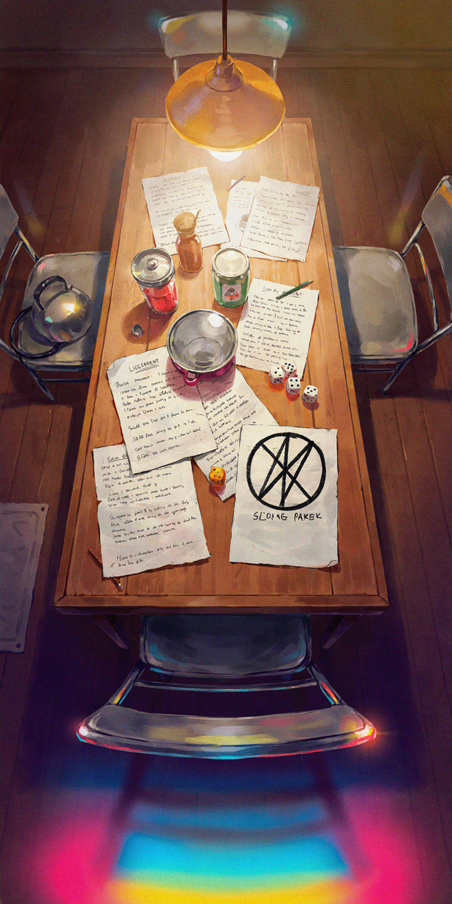

A rough clock for a four-hour evening with a new group.

| Time | What is happening |
|---|---|
| 0:00–0:30 | Safety tools, then hand out Stars or make them |
| 0:30–1:15 | **Verse.** Ordinary life. The problem arrives at the end |
| 1:15–2:00 | **Chorus.** They try; it is not enough; the clock is revealed |
| 2:00–2:20 | Break. Genuinely, take one |
| 2:20–2:45 | **Bridge.** The quiet scene, the truth, the command word, airtime |
| 2:45–3:45 | **Big Finish.** Turn order, the clock, the Chord |
| 3:45–4:00 | Return to the everyday. The one thing that changed |

The two most common failures are both in the first half: rushing the Verse, and
letting the Chorus become the whole session because nobody has said anything
true yet. If you are at the two-hour mark and no one has morphed, stop
whatever is happening and force a quiet two-person scene.

## Your first three sessions

**Session one.** Use the pregenerated Stars in [Chapter 6](#five-stars-ready-to-play) and The Last Bus in
[Chapter 10](#the-first-number). Do not improvise a Gloom yet. Your entire job is to get comfortable
asking *"what do you say?"* and then waiting.

**Session two.** Same Stars, new Gloom, one from [Chapter 9](#the-gloom), reskinned to your
own town. Now you are practising the conversion procedure with training wheels
still on.

**Session three.** Ask the table: *"what's been allowed to go grey near you?"*
Build the Gloom out of their answer. This is the version of PRISM the book is
actually for, and you should not attempt it first, because it works far better
once everyone trusts the format.

## If you only remember five things

1. **Name the Difficulty before the dice**, and do not move it after.
2. **Every Miss changes the situation**, and the clock tick *is* the move.
3. **Ask for the words**, then wait longer than feels natural.
4. **Reaching a Dimmed Star always works.** No roll, ever, under any
   circumstances.
5. **Come back to the everyday at the end**, and say the one small thing that is
   different now.

Everything else in this chapter is commentary on those five.

## Running the Spectrum without exhausting yourself

The commonest Showrunner complaint about bright settings is that describing
them is tiring. Three habits fix it.

**Three things, then stop.** One colour, one impossible object, one sound. Let
the table build the rest, and they will, immediately, because a maximalist
setting invites contribution in a way a restrained one does not.

**Hand the description away.** *"Toby, what's over there that shouldn't be?"*
Whatever the player says is now true. This costs you nothing, makes the world
feel inhabited, and is the single best trick in the chapter.

**Keep one ordinary thing in frame.** A bin, a bus stop, a specific cracked
paving slab. The Spectrum only feels strange in proportion to how much of the
everyday is still recognisably inside it. A scene with no anchor stops being
uncanny and becomes wallpaper.

## When a session goes wrong

It will, once. Two recoveries worth having ready.

**Nothing is happening and everyone is being polite.** Cut to the person paying
the cost. Not a fight, not a clue, just the NPC, doing an ordinary thing,
visibly worse off than in the last scene. It works almost every time, because
the table wants a reason and you have just handed them one.

**Somebody is not enjoying themselves and you cannot tell why.** Call the break
early. Ask them, away from the table, what they would like their Star to get to
do. Then put that in the next scene, unsubtly. PRISM does not punish you for
being obvious about giving a player what they asked for.

## One last thing

You will be tempted, somewhere around session three, to introduce a Gloom with
a plan. Something that schemes, that has been watching the Stars, that turns
out to have arranged the last two Numbers.

Do not.

The moment a Gloom has intentions it becomes a villain, and a villain makes
this a game about defeating someone. PRISM is a game about *noticing*, about
five people deciding on purpose to care about a thing that was being allowed to
slide. The antagonist has to stay a shape rather than a mind, because the
enemy in this game was never a person. It was the ordinary, forgivable,
universal habit of assuming somebody else had it covered.

Keep the monsters mindless. Put all the intention on the side of the table.

---

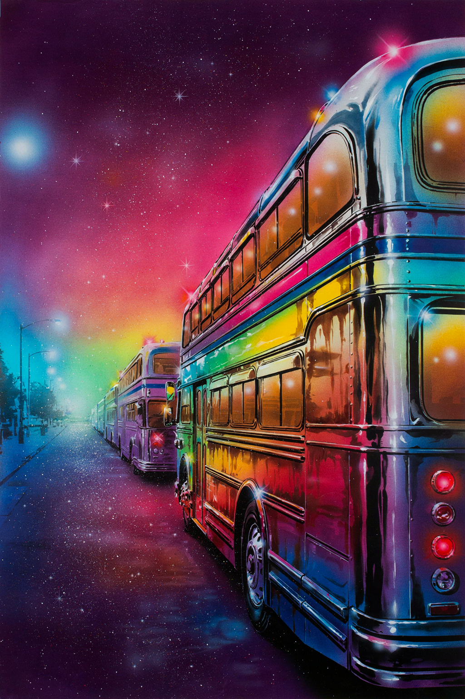
# The Gloom

## How to read a Gloom

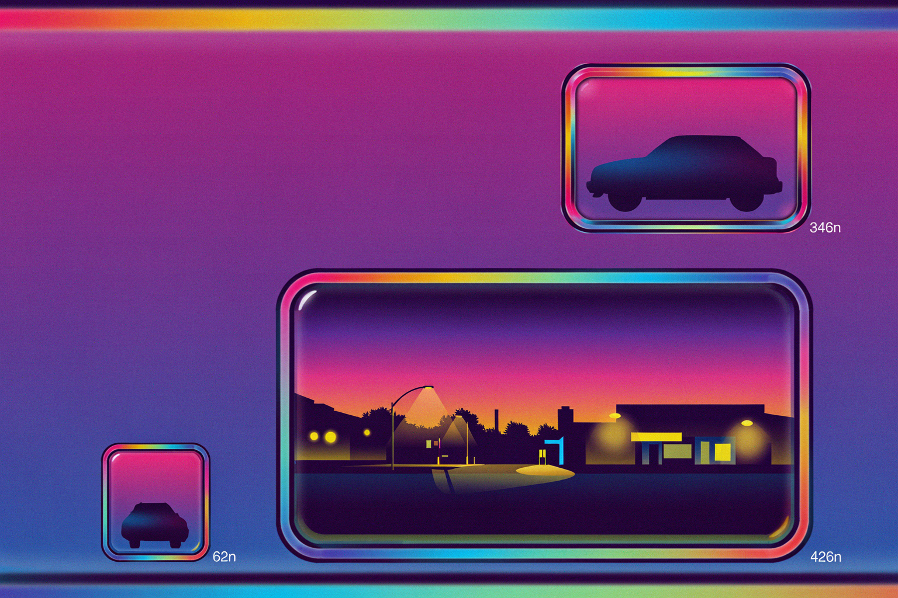

Six ready to run. Each one is a real neglect first and a monster second, and
that order matters, if you can only remember one thing from this chapter,
remember that you build these out of paperwork rather than out of teeth.

Every entry has five parts:

- **Clock**: how many segments, all of them full at the start.
- **In the everyday**: the ordinary, unglamorous thing this actually is.
- **In the Spectrum**: the body it has when the light splits.
- **Moves**: the three things it does on a Miss. Not attacks; things it *does*.
- **When it falls**: the one concrete thing that changes back home.

None of them has a personality, a plan, or a line of dialogue. They are not
being cruel. They are shapes that things fall into.

---

## The Last Bus (clock 6)

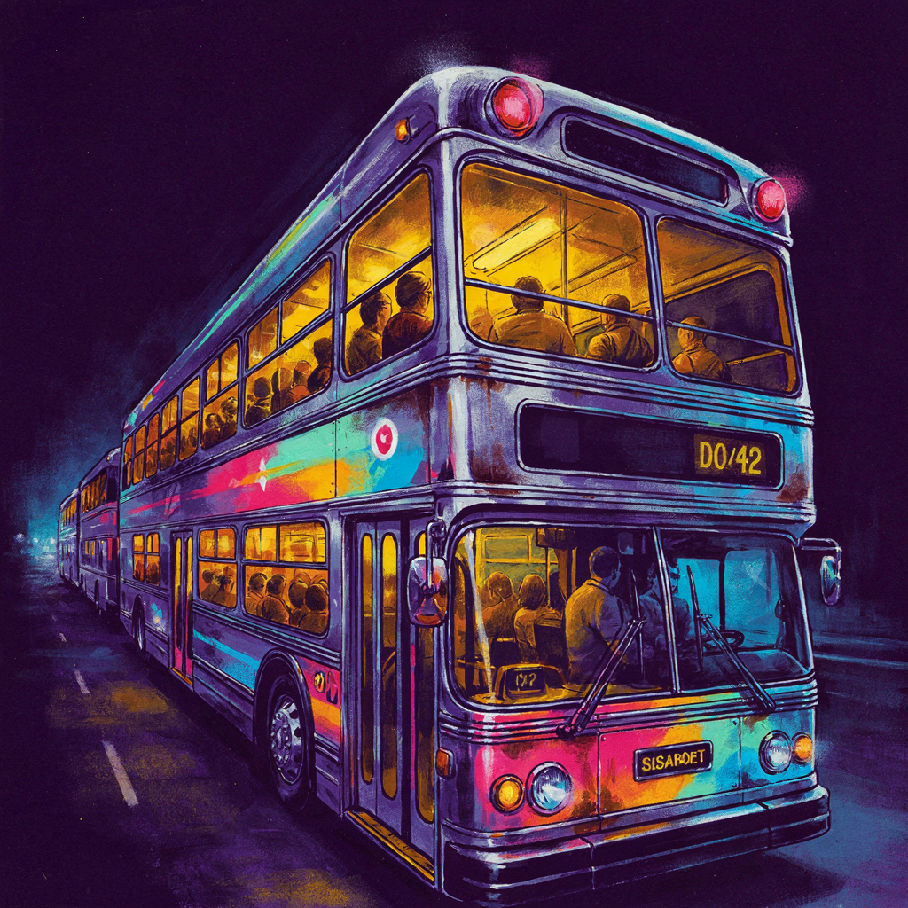
**In the everyday:** A night bus route, cancelled. The 41, which used to run
until half twelve and now stops at nine. Nobody protested; there was a
consultation and eleven people responded.

**In the Spectrum:** A bus the length of a street. Three storeys of chrome and
rust, windows lit from inside by something warm that you cannot quite see into.
Headlights like dead suns. It is **always pulling away**, never arriving,
never chasing. The doors are always closing, and there is always one more
person on the pavement.

**Moves:**
- *Strand someone.* A Star finds themselves alone at a stop that was crowded.
- *Make the distance longer.* Where they are going is further than it was.
- *Convince them it was always like this.* Was there a 41? Are they sure?

**When it falls:** The route runs again on Fridays. Two people who had stopped
seeing each other are on it, and neither planned that.

---

## The Quiet Shelf (clock 4)


**In the everyday:** A library open two days a week instead of five. The
reading group folded. The photocopier has a sign on it.

**In the Spectrum:** Shelves that grow taller and further apart the longer you
walk between them, until the aisles are canyons and the ceiling is a rumour.
Warm, silent, and entirely indifferent. A returns slot high in one wall that is
always about a foot out of reach.

**Moves:**
- *Shorten the hours.* A door that was open is closed, with a laminated note.
- *Lose the thing somebody needed.* It was here. It is catalogued. It is gone.
- *Empty a room.* The people who were here are not, and were not, ever.

**When it falls:** The Tuesday reading group starts again. Four people. One of
them is new.

---

## The Silt (clock 6)

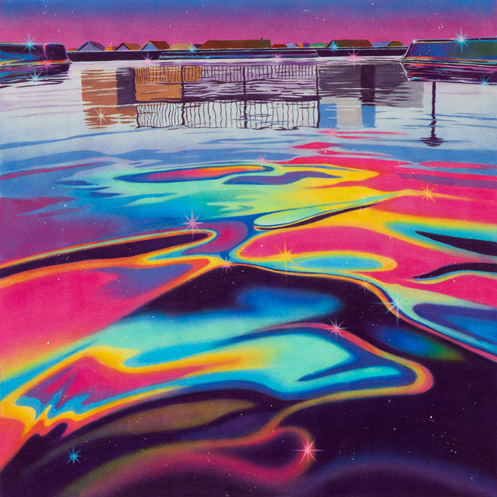
**In the everyday:** A stretch of river nobody clears. Two shopping trolleys, a
bike frame, and the slow accumulation of everything that is technically
somebody else's job.

**In the Spectrum:** A chrome tide, mirror-bright and thickening, moving at the
speed of a minute hand. It swallows landmarks one at a time and reflects them
back very slightly wrong, the footbridge with one railing too many, the church
with its clock at a time it has never been.

**Moves:**
- *Thicken.* Movement costs more than it did.
- *Swallow a landmark.* Something the Stars were navigating by is under it now.
- *Make it somebody else's job.* Whoever should deal with this, it is not them.

**When it falls:** You can see the bottom by the footbridge again. Somebody
takes a photograph of it, which is a strange thing to photograph.

---

## The Long Weekend (clock 4)

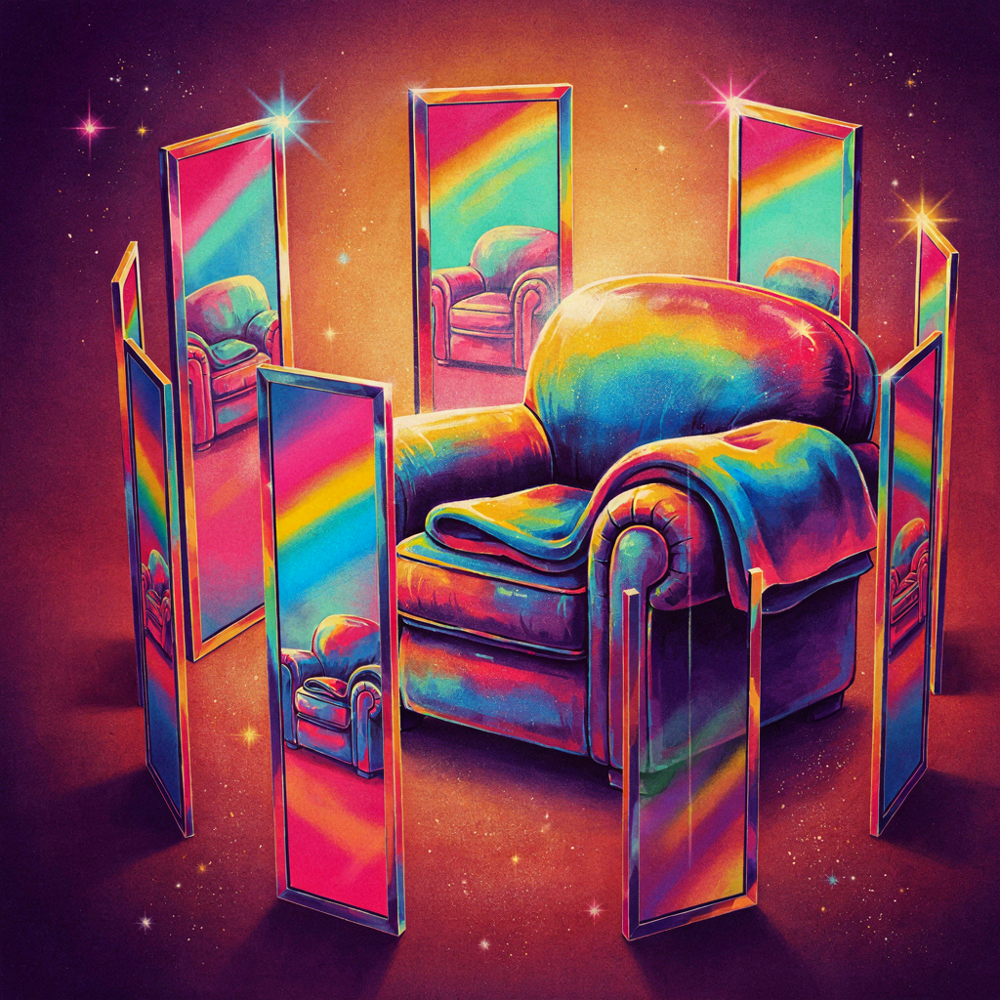
**In the everyday:** Somebody nobody has rung in a month. Everyone assumed
someone else had. Everyone was wrong in the same direction.

**In the Spectrum:** A very comfortable room that keeps adding doors, all of
which lead back into it. Deep chairs. Good light. A blanket that is exactly
warm enough. A voice, not threatening, genuinely kind, that keeps agreeing
that you are probably too tired for that tonight.

**Moves:**
- *Make it easier to stay in.* The chair is very good. The rain has started.
- *Cancel a plan.* Somebody texts to say no worries, another time.
- *Offer a good excuse.* And it is a good one. That is the trouble.

**When it falls:** They answer the phone. They are embarrassed about how long it
has been. They come out anyway.

**A note:** This one is the closest to somebody's real life at almost every
table. Ask first.

---

## The Grey Ledger (clock 8)

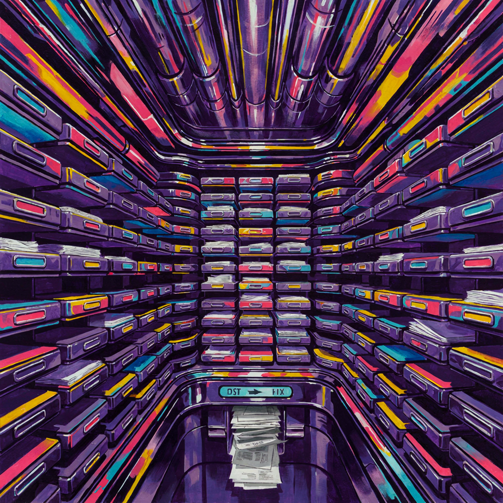
**In the everyday:** A community centre being wound down by committee. Nobody
decided to close it. It is being reviewed, and then reviewed again, and the
boiler is not being fixed in the meantime.

**In the Spectrum:** An enormous filing structure, shelves and drawers and
pneumatic tubes going up past where the sky should be, that **reclassifies
whatever it touches.** A football pitch becomes an asset. A choir becomes a
line item. A person becomes a case. Everything it processes comes out true,
accurate, and completely drained.

**Moves:**
- *Reclassify.* Something the Stars care about is now a category.
- *Require a form.* There is a process for this. The process is not available.
- *Promise a review.* In due course. Nobody is saying no.

**When it falls:** The booking system reopens. Somebody books the hall for a
birthday party, on a Saturday, for forty people.

---

## The Understudy (clock 6)

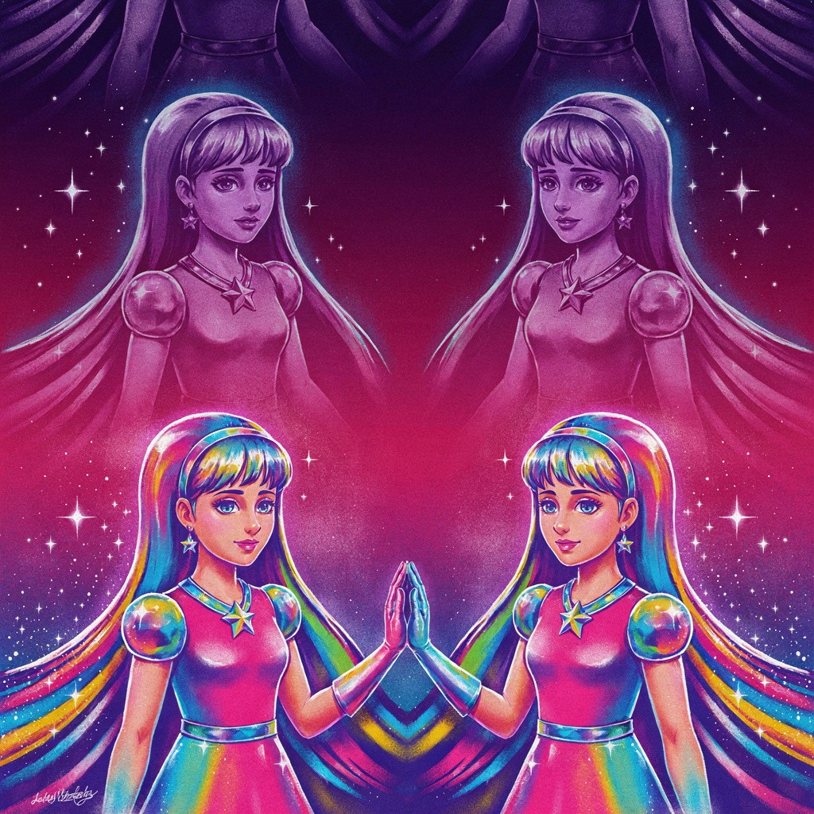

**A note for the Showrunner:** This is the only Gloom that is about the Stars
themselves rather than the town, and it needs a lighter hand than its clock
size suggests. Never let The Understudy be contemptuous, the moment it sneers,
it becomes a villain and stops being frightening. It should be *kind*. Check in
before you run it, and again after.

**In the everyday:** Burnout. Specifically the belief, arrived at quietly, over
months, that your effort was never the point and the thing would have happened
anyway.

**In the Spectrum:** A figure that is almost exactly a Star. Same silhouette,
same colour, slightly better. It does their Signature more cleanly than they
do. It is not mocking them; it is genuinely, patiently helpful, and it keeps
offering to take over so they can rest.

**Moves:**
- *Offer to do it for you.* And it would do it well.
- *Be better at being you.* It performs a Star's own Signature, correctly.
- *Ask why you bother.* Not cruelly. As though it would like to know.

**When it falls:** The Star it was shadowing does one small ordinary thing
badly, on purpose, in front of everyone, and it is fine.


---

## Building your own

[Chapter 7](#your-town-and-the-spectrum) has the five-step procedure. Two additions now that you have seen six
of them.

**Give it one verb.** Every Gloom above is doing exactly one thing forever.
Pulling away. Growing taller. Thickening. Getting more comfortable.
Reclassifying. Offering. If you cannot say your Gloom's verb in one word, it is
not built yet.

**Write the "when it falls" line first.** Before the body, before the moves,
before the clock. That sentence is the reason the table is spending an evening
on this, and if it does not make *you* feel something in prep, it will not
survive contact with the Big Finish.

Then check it against three questions:

1. Could a Star point at the everyday version?
2. Is it doing something rather than wanting something?
3. Is the thing that comes back small, concrete, and specific?

Three yeses and you have a Number.

## Reskinning these six

You will run out of ready-made Glooms faster than you expect, and the fastest
way to make more is to keep the *skeleton* and change the subject.

Each of the six above is really a shape:

| Gloom | The shape underneath |
|---|---|
| The Last Bus | A connection that used to exist and now does not |
| The Quiet Shelf | A place that was free and is now conditional |
| The Silt | A slow accumulation nobody owns |
| The Long Weekend | A kindness that has become an excuse |
| The Grey Ledger | A process that turns people into categories |
| The Understudy | A person who has concluded they are optional |

Any of those shapes will take a new subject without complaint. The Last Bus
becomes a phone tree that has quietly stopped being answered. The Quiet Shelf
becomes a park that now needs booking. The Silt becomes a group chat that
nobody has read in five months, thickening with everything unsaid.

Keep the clock size, keep the three moves, rewrite the body and the "when it
falls" line. Twenty minutes of prep, and it will not feel like a repeat,
because the everyday problem is what your players actually engage with and that
part is entirely new.

## What Glooms never do

A short list, because the temptation is real and it will ruin them.

**They never taunt.** No dialogue, no gloating, no monologue. The moment a
Gloom explains itself it becomes a villain, and villains can be argued with,
and a thing you can argue with is not frightening in this particular way.

**They never target a Star personally**, with one deliberate exception, The
Understudy, which is why that one needs care. Glooms do not have grudges. They
have appetites, and appetites are not about you.

**They never adapt.** They do not learn from the Stars' tactics, counter their
Signatures, or change plan between rounds. They cannot. Whatever they were
doing in the Verse, they are still doing in the Big Finish, only closer.

**They never win by escalating.** The clock does not grow. The only way a Gloom
takes the night is by grinding five people down until every one of them is
Dimmed, and that takes a long, bad run of dice and a group who stopped helping
each other.

## What each of these is really asking

[Chapter 8](#running-the-game) lists the hinge for every Gloom here: the truth that has to get said
before the Bridge can land. It is worth reading that table alongside this
chapter, because the monster and the admission are the same object seen from two
sides. The Last Bus is a bus, and it is also *"I stopped going out and I didn't
notice."* You are not building an encounter. You are building the shape of
something somebody has not said yet.

---


# The First Number

## The Last Bus

A complete story for one evening. Written for the five Stars in [Chapter 6](#five-stars-ready-to-play), hand them out, read this, and run it cold.

**The Gloom:** The Last Bus, clock **6**. Full stats in [Chapter 9](#the-gloom).

**The hinge, the truth that has to get said:** *"I stopped going out and I
didn't notice."*

**What comes back:** The 41 runs again on Fridays, and two people who had
stopped seeing each other are on it.

---

### Verse, the ordinary world

Open on a Thursday evening in the everyday. No Spectrum, no monster, no hurry.

Go round the five and ask each of them one small question:

- **Wren**: who did you text today and not hear back from?
- **Toby**: what did you nearly break this week?
- **Priya**: what is in your pockets right now?
- **Marisol**: what did you do today that nobody thanked you for?
- **Danny**: who told you something you have not repeated?

Write the answers down. **At least one of them comes back in the Big Finish** —
the person who did not text back is on the bus, the thing Toby nearly broke is
what jams the doors, the thing nobody thanked Marisol for is exactly what she
does again at the worst moment. That is the whole reason you asked.

Then put them somewhere together. A chip shop, a bus shelter, the wall outside
a closed leisure centre. Let them talk for as long as it stays interesting.

**The problem arrives at the end of the Verse.** Keep it small:

> There is a woman at the stop. She has been there a while. She is not agitated
>, she keeps checking the timetable and then checking her phone, and the
> timetable says the 41 comes at 22:47, and it is 23:20.
>
> She says, to nobody: *"It's fine. It was probably always this early."*
>
> And none of you can remember the last time you got the 41.

Let them investigate in the everyday. The timetable is real and says 22:47. The
council page says the route was reduced in March. Nobody remembers a
consultation. The woman's name is Fen and she works late at the bakery on
Tolgate Street.

**No rolls yet unless someone insists.** If they do: Easy.

### Chorus, the seam and the bus

They find the seam, and they do not go through it. Not yet. Crossing over *is*
morphing, one move and not two ([Chapter 4](#transformation)), and the morph is
the Bridge. What happens in the Chorus is that the Spectrum leans on the
everyday from the other side, hard enough to come through.

A bus shelter at the wrong time of night is the most obvious seam in the book,
so let it be that: the timetable's letters go slightly too crisp, the strip
light takes a beat too long, and Tolgate Street stops being only one street.

**First look, through the seam.** Give this thirty seconds of pure description
and do not let anyone roll through it.

> The chrome shelter reflecting a street with one more shop on it than this one
> has. Glitter banked in the gutters, but only in the reflection. Nine colours
> coming off a puddle that should hold two. Something enormous moving very
> slowly two streets over, and the sound of it arriving half a second after the
> shape does.

Then the bus, which does not stay on its own side of the glass.

> Three storeys of chrome and rust, the length of the whole street, pulling
> away from a stop it never quite reached. Headlights like two dead suns.
> Every window lit and warm and full of people who are not looking out. And on
> the pavement, running, not catching it: Fen.

**Reveal the clock at full — 6.** Say the number out loud and mark all six.

Let them try the sensible thing. It will be one of:

- **Get in front of it.** Flash or Heart, **Tricky**.
- **Get the doors.** Craft, **Tricky**. (Priya's Signature drops this to Easy if
  she works out the hydraulics.)
- **Get Fen.** Heart, **Tricky**. (Wren's Signature drops this, she is
  refusing to abandon someone.)

Whatever they do, it is not enough *against the bus*. If somebody gets to Fen,
they get to Fen: she is off the road, shaken, and safe, and that sticks. What
they cannot do is stop the thing. It does not fight back. It simply keeps
pulling away, and the street keeps getting longer.

**Use the moves:** strand someone, make the distance longer, convince them it
was always like this. On a Miss with the clock full, which it will be, take
**1 Shine** and describe the cold coming off it.

**Nobody should morph here**, which is the same sentence as *nobody should
cross yet*. If someone does anyway, that is your Bridge and you skip to it.

### Bridge, the question you came for

Make room. Split them up, the bus separates people, that is its whole
function, and put two Stars alone somewhere.

Then ask the question you came for. Aim it at whoever has been quietest:

> *"You haven't been out on a Friday since March. Had you noticed?"*

What you want is somebody saying a version of *"I stopped going out and I
didn't notice."* Wait for it. Do not fill the silence.

When it lands, command word. All five.

> **"PRISM — SPLIT THE LIGHT!"**

And they refract, which is to say they cross and they change in the same
movement, because in PRISM those were never two things.

**Airtime.** Everyone narrates their own morph, uninterrupted, in turn. No
dice. However long it takes.

### Big Finish, transformed and running
Turn order starts now: round the table, one action each, you between rounds.

The bus is still pulling away and now they can catch it. Robot unicorns are
absolutely permitted here and Toby will probably suggest it first.

**Run the race.** The clock is wherever the Chorus left it, so 6 if that scene
went badly and 5 if somebody landed a Hit. Everyone's Shine visible. Say the
clock out loud every time it moves.

Things to have happen:

- **Fen**, if nobody got to her in the Chorus, is on the pavement still, and
  going to her costs a whole action and is worth it. If somebody did get to
  her, she is behind them, watching, and will not go inside.
- **The inside of the bus.** If they get aboard: rows of warm, comfortable
  people, none of them looking up, all of them absolutely fine. This is the
  image that makes players angry, in the good way.
- **Round three, roughly**, someone will go Dimmed. Let it happen. Then wait, do not prompt the rescue. Somebody will go.

**Watch the Chord.** Do not announce it when it fills. Let a player notice.

**Combined Form** needs a Synchronized Morph (done at the Bridge), a full
Chord, and the Big Finish (you are in it). When they call it, stop everything
and have all five describe one piece of the fused thing, then weld it together
out loud.

The finisher empties the clock. Let them name it.

### The last thirty seconds

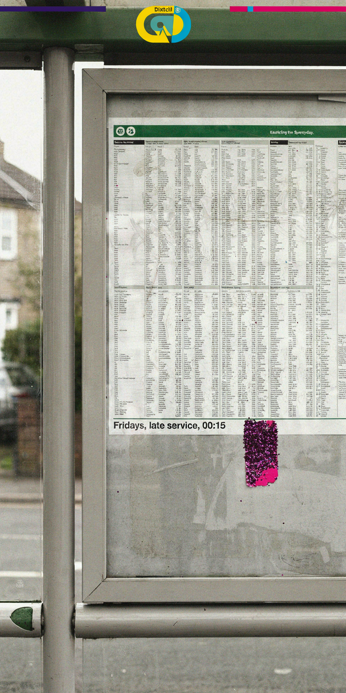

Come back to the everyday. Thursday, 23:40, Tolgate Street, exactly as it was.

> The shelter is just a shelter. There is glitter in the seam of Wren's sleeve
> that will still be there on Sunday.
>
> The timetable says the 41 comes at 22:47, and underneath, on a printed strip
> that was not there before and has clearly been there for years, *Fridays,
> late service, 00:15.*
>
> Fen is sitting down. She is not waiting for anything. She says: *"I might go
> out Friday, actually."*

End there. Encore next session.

---

## Quick reference

**The roll:** 2d6 + Trait vs Difficulty. Keep the best two dice, always two.

**Difficulties:** Easy **6** · Tricky **9** · Dazzling **11**

| Result | Outcome |
|---|---|
| Under | **Miss**: Showrunner makes a move |
| Meets, or +1–2 | **Mixed**: it works, and it costs |
| +3 or more | **Hit**: clean |
| Both kept dice show 6 | **Flourish**: clean, double effect, plus something |

**Mixed costs** (Showrunner names one; player may take 1 Shine instead):
lose 1 Shine · spend 1 Sparkle · Exposure · Gloom +1 tick

**Backing:** +1d6, still keep two. Costs the backer 1 Shine, 1 Sparkle, their
next action (Big Finish only), Exposure, or a Bond.

**Sparkle:** start 3, max 3 (5 only after long play). Morph · reroll a die ·
ignore 1 Shine · Finisher.
Refresh 1 when your Refrain costs you something, once per scene.

**Shine:** 5 boxes. At 0 you are Dimmed, present, not dead, cannot act, cannot
morph. Reaching a Dimmed Star always works, no roll: costs the rescuer 1 Shine
or 1 Sparkle plus their action; they return with 2 Shine; both notes sound.

**Gloom clock:** starts full (4/6/8). Miss +1, or −1 Shine if already full.
Mixed/Hit −1. Flourish −2. Cannot go below 1 before the Big Finish. Empty = win.
Gloom wins only if every Star is Dimmed.

**Signature:** drops a task one Difficulty band. Below Easy there is no band, so
you simply do it, no roll. Never a bonus to the total.

**Morphs:** Solo 1 Sparkle, +2 Shine, cap +2. Synchronized 1 Sparkle paid by one
Star, unlocks Formation / chained backing / group finisher.

**Combined Form** needs all three: a Synchronized Morph, a full Chord, and the
Big Finish. Traits are the best of each across the team, capped at +2. Shine is
the sum of everyone's current Shine. Its finisher empties the clock for 1
Sparkle, paid by any one Star.

**The Chord:** sound your note the first time you back someone at a cost, have
your Refrain cost you, or are pulled back from Dimmed.

**Beats:** Verse (everyday) · Chorus (goes badly) · Bridge (morph) · Big Finish
(transformed) · Encore (between Numbers).

---

## Character sheet

```
NAME ................................  COLOUR ......................

HEART  +___     FLASH  +___     CRAFT  +___     COOL  +___
                    (one +2, two +1, one +0)

REFRAIN ..............................................................

SIGNATURE .......................  Drops a band when ..................
......................................................................

LOOK .................................................................
......................................................................

RADIANCE
  Colour .............................................................
  Silhouette .........................................................
  Sound ..............................................................
  Phrase: " .........................................................."
  Object .............................................................
  Transformed ability ................................................

SPARKLE  [ ] [ ] [ ]                SHINE  [ ] [ ] [ ] [ ] [ ]   ( ) ( )
         (start 3, max 3;                  (5 boxes, plus the two
          5 only after long play)           in brackets while morphed)

MY NOTE ON THE CHORD  [ ]

BONDS
  To ..............  ..................................................
  To ..............  ..................................................
  To ..............  ..................................................
  To ..............  ..................................................

TEAM ...................  COMMAND WORD " ............................ "
```

---

## Credits

**PRISM** — text and design.

### Artwork

- 32 images — Generated locally with Ideogram 4 via ComfyUI, from the structured captions in `development/art_prompts.md`.
- 1 image — Generative artwork produced in-repo by `development/cover_sketch/refraction.js`.

No third-party image assets are used.
